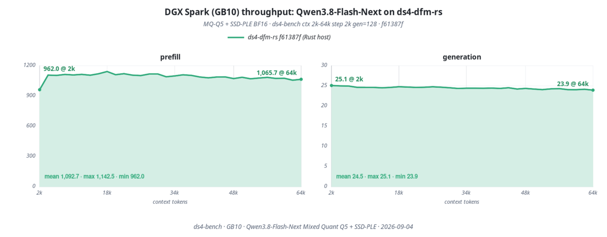

# DwarfStar / ds4-dfm-rs

**DwarfStar** (`ds4`) is a small native inference engine specialized for a
deliberately limited set of large open-weight models. It is self-contained and
deliberately narrow, not a general GGUF runner and not a wrapper around another
runtime. Model loading, prompt rendering, tool calls, model state, KV reuse,
the HTTP server, and the coding agent are built and tested together.

`ds4-dfm-rs` is the independent Rust-host continuation of the DFM line from
[`Baekpica/ds4`](https://github.com/Baekpica/ds4). Its NVIDIA reference machine
is the 128 GB DGX Spark / GB10. It retains the native Metal and CUDA heritage,
but this release's complete live gate ran on CUDA.

As in the original [`antirez/ds4`](https://github.com/antirez/ds4), model
support is intentionally opportunistic. The project follows useful open
weights that fit real personal and workstation-class machines. A family is
supported explicitly, against a known artifact and execution path; it may be
retired when a better model makes it irrelevant.

## So, what can I do with this software?

- Run one of the seven validated model families on a DGX Spark without pulling
  in a general inference framework.
- Serve OpenAI-compatible Chat, Completions, and Responses APIs, Anthropic
  Messages, or use the native coding agent against the same model lifecycle.
- Use long contexts, persistent KV state, distributed execution, and the
  family-specific acceleration path that was actually validated for the model.
- Serve Qwen3.8 Flash Next Q5 with SSD-PLE sidecars, embedded MTP, and still
  image input.
- Treat the existing family implementations as rails for a new model or a
  specific machine, while keeping the resulting path small enough to inspect.

## Motivations

- Capable open-weight models now fit on high-end personal machines.
- Routed-expert quantization, compressed or recurrent state, and fast local
  SSDs make very large models and long contexts practical on those machines.
- An inference system specialized for a few models can remain understandable,
  measurable, and aggressively optimized.
- DFM (독자 파운데이션 모델, 독파모) and adjacent families are increasing,
  but their tensor layouts, state machines, prompt protocols, and kernels are
  meaningfully different.
- A Rust host can make those families safer to operate and easier to extend
  without hiding the differences behind a large abstraction layer.

## How to use this project

The original DwarfStar is also a statement about how software can be shipped
in the age of coding agents: a repository can be a working implementation for
the most useful cases and a rail for adapting a new model or hardware setup,
instead of pretending to cover every possible combination.

That remains the intended use here. Start from a validated family, make the
smallest explicit change for the new tensor, state, protocol, or kernel
contract, and rerun the same correctness and performance gates. Coding agents
can make a specialized port much cheaper; they do not replace real artifacts,
hardware measurements, or human ownership of the result.

## AI full disclosure

This line is developed with strong coding-agent assistance, with humans leading
the ideas, scope, testing, and debugging. We say this openly because it shaped
both the Rust migration and the model-family work. It is equally important to
say that DwarfStar would not exist without the largely hand-built work in
[`llama.cpp`](https://github.com/ggml-org/llama.cpp) and GGML, or without the
original DwarfStar and Entrpi CUDA-serving work preserved in this history.

## Why this repository exists

The split is not meant to turn ds4 into a generic framework. It makes a growing
set of DFM and adjacent model families more efficient to extend while keeping
the minimum abstraction that proven families actually share. Rust owns host
lifecycle and serving policy; the native engine stays close to the hardware.

This is therefore **not a rewrite of ds4 in Rust**. The project preserves the
optimized C/CUDA/Metal backend, Git ancestry and authorship, and the full
`antirez → Entrpi → Baekpica` lineage.

## Status

`v0.1.0-rc.4` adds the explicit GLM 5.3 Flash Q2 text and still-image path to
the Rust host. Its release claim is limited to the two artifacts and the DGX
Spark CUDA execution path documented below.

| Item | RC scope |
|---|---|
| Release baseline | `v0.6.5-dfm` (`d02e2a4`) |
| Frozen Qwen C behavior | post-tag cut `4d40d97` |
| Split genesis | annotated tag `ds4-dfm-rs-genesis` (`fe7733f`) |
| Release-tested hardware | NVIDIA DGX Spark / GB10, CUDA |
| Host migration | Rust default binaries; C binaries retained as oracles |
| Native backend | C/CUDA/MMQ/VMM/vision kernels retained |
| License | MIT, inherited notices preserved |

The pre-split campaign finished with 60 logical cells: 57 PASS and three
PASS* cells reproduced on the matching C control, with no Rust-only failure.
The detailed evidence is in
[`SPLIT_READINESS.md`](docs/rust-migration/SPLIT_READINESS.md).

This remains release-candidate software. It accepts only explicit, validated
GGUF layouts; it is not a general GGUF runner.

## Design philosophy

- Keep model mechanics visible. Shapes, tensor names, state layouts, prompt
  protocols, and stop rules are family contracts, not plugin metadata.
- Add only the abstraction shared by proven families. Prefer an enum, a table,
  or a narrow function over a runtime plugin system.
- Keep the hot path direct. Family dispatch must not force dynamic dispatch or
  erase kernel-specific information.
- Use Rust where ownership matters: HTTP, admission, scheduling, model/session
  lifetime, KV policy, memory policy, and distributed orchestration.
- Keep CUDA, MMQ, VMM, fused attention, MoE, SSD-PLE, and vision execution
  native. A host-language change is not permission to rewrite kernels.
- Promote behavior only after C/Rust parity, real-model checks, and measured
  performance. Goldens are not refreshed to hide drift.

The practical family-extension contract is intentionally small:

1. identify and validate the GGUF shape;
2. resolve the tensor inventory and bind plan;
3. define tokenizer, prompt, tool, and stop behavior;
4. connect the native state and kernel path through the opaque bridge;
5. define session/KV ownership and serving-lane eligibility;
6. land a focused regression, then loader, forward, API, live, and performance
   evidence.

## Architecture

```text
OpenAI / Anthropic clients, CLI, agent
                    │
                    ▼
┌──────────────────────────────────────────────┐
│ Rust host                                    │
│ HTTP · rendering · admission · scheduler     │
│ model/session lifecycle · KV · memory policy │
│ distributed orchestration                    │
└──────────────────────┬───────────────────────┘
                       │ narrow opaque ABI
                       ▼
┌──────────────────────────────────────────────┐
│ Native backend                               │
│ GGUF mmap · VMM · CUDA Graph · MMQ           │
│ fused attention · MoE · SSD-PLE · vision     │
│ CUDA / Metal / CPU reference                 │
└──────────────────────────────────────────────┘
```

The boundary is [`native/bridge/ds4_bridge.h`](native/bridge/ds4_bridge.h),
not a generated binding of the engine internals. Safe Rust never receives
CUDA streams, device pointers, graph handles, VMM allocation handles, or raw
native structs.

| Area | Owner |
|---|---|
| API parsing, rendering, streaming, routing | Rust (`ds4-server`) |
| GGUF identification, validation, inventory, bind plan | Rust (`ds4-core`) |
| Model/session handles and lifetime policy | safe Rust over opaque native handles |
| KVC metadata, persistence policy, cross-host codecs | Rust (`ds4-kv`) |
| Distributed protocol and orchestration | Rust (`ds4-dist`) |
| CUDA/VMM/MMQ/graphs/attention/MoE/vision | native C/CUDA |
| Metal and CPU reference paths | inherited native backend |
| C parity executables and `ds4-eval` | retained release oracles |

The host uses blocking sockets, threads, channels, mutexes, and condition
variables. There is no async framework added merely because the host is Rust.
See [`ARCHITECTURE.md`](docs/rust-migration/ARCHITECTURE.md) and
[`FFI_CONTRACT.md`](docs/rust-migration/FFI_CONTRACT.md) for the full boundary.

## Supported hardware and backends

| Backend | Status in `v0.1.0-rc.4` |
|---|---|
| NVIDIA DGX Spark / GB10 | Release target. The split-era full matrix, long-context, Qwen image/MTP, ABBA, and soak gates ran here; RC.3's agent-serving matrix and RC.4's GLM Q2 text/vision gates also ran here. |
| Other NVIDIA CUDA systems | Source path retained through `make cuda-generic` or an explicit `CUDA_ARCH`; not covered by the RC's full live matrix. |
| macOS Metal | Inherited source/build path retained; not part of the DFM RC live gate. |
| CPU | Reference and diagnostics only, not a production performance backend. |

The recorded RC host used CUDA 13.3.73, driver 610.43.02, Linux
6.17.0-1031-nvidia, and Rust 1.98.0. Do not generalize its measurements to a
different GPU or quant without rerunning the same gate.

## Supported model families

Every family below has an explicit architecture selector, validator, binder,
tokenizer/chat contract, state lifecycle, and native execution path.

| Family | GGUF architecture | RC note |
|---|---|---|
| DeepSeek V4 Flash / PRO | `deepseek4` | Flash is the main live oracle; external MTP/DSpark support is DeepSeek-only. |
| Solar Open2 250B | `solar-open2` | Recurrent KDA state, compressed GQA KV, persistent banks. |
| K-EXAONE 236B A23B | `exaone-moe` | LLLG full/sliding GQA KV and persistent banks. |
| Motif-3 | `motif3` | Latent KV, rotated `k_pe`, SWA rings, persistent banks. |
| dots3-note Preview | `dots3-note` | Dual-geometry latent state; current live serving path is serial. |
| Qwen3.8 Flash Next SSD-PLE | `qwen4exp` | Q5 main GGUF + four shared SSD-PLE sidecars, embedded MTP, N-bank Rust scheduling, still-image input; one- and two-bank live gates. |
| GLM 5.3 Flash | `glm5-next` | Q2 single-file GGUF plus the explicit vision sidecar; CUDA serial serving on one DGX Spark. |

The current family contract and measured model-specific limits are documented
in [`ds4-dfm-model-families.md`](docs/ds4-dfm-model-families.md). Arbitrary
GGUFs, alternate tensor layouts, and unlisted architectures are rejected.

### Model Zoo

The five Baekpica artifacts are grouped in the
[`DS4-Mixed-Quant-for-Spark`](https://huggingface.co/collections/Baekpica/ds4-mixed-quant-for-spark)
collection. Support remains limited to the validated layouts described above.

| Model | GGUF artifact | Artifact by |
|---|---|---|
| DeepSeek V4 Flash / PRO | [`antirez/deepseek-v4-gguf`](https://huggingface.co/antirez/deepseek-v4-gguf/tree/main) | [`antirez`](https://huggingface.co/antirez) |
| Solar Open2 250B | [`Baekpica/Solar-Open2-250B-Mixed-Quant-GGUF`](https://huggingface.co/Baekpica/Solar-Open2-250B-Mixed-Quant-GGUF) | [`Baekpica`](https://huggingface.co/Baekpica) |
| K-EXAONE 236B A23B | [`Baekpica/K-EXAONE-236B-A23B-Mixed-Quant-GGUF`](https://huggingface.co/Baekpica/K-EXAONE-236B-A23B-Mixed-Quant-GGUF) | [`Baekpica`](https://huggingface.co/Baekpica) |
| Motif-3 | [`Baekpica/Motif-3-Mixed-Quant-GGUF`](https://huggingface.co/Baekpica/Motif-3-Mixed-Quant-GGUF) | [`Baekpica`](https://huggingface.co/Baekpica) |
| dots3-note Preview | [`Baekpica/dots3-note-prev-Mixed-Quant-GGUF`](https://huggingface.co/Baekpica/dots3-note-prev-Mixed-Quant-GGUF) | [`Baekpica`](https://huggingface.co/Baekpica) |
| Qwen3.8 Flash Next SSD-PLE | [`Baekpica/Qwen3.8-Flash-Next-Mixed-Quant-SSD-PLE-GGUF`](https://huggingface.co/Baekpica/Qwen3.8-Flash-Next-Mixed-Quant-SSD-PLE-GGUF) | [`Baekpica`](https://huggingface.co/Baekpica) |
| GLM 5.3 Flash | [`GLM-5.3-Flash-Q2.gguf`](https://huggingface.co/antirez/glm-5.3-flash-gguf/blob/main/GLM-5.3-Flash-Q2.gguf) + [`vision encoder`](https://huggingface.co/antirez/glm-5.3-flash-gguf/blob/main/GLM-5.3-Flash-Vision-Encoder.gguf) | [`antirez`](https://huggingface.co/antirez) |

### Qwen release scope

The Qwen RC claim is deliberately narrow:

- [`MQ-Q5-SSD-PLE-BF16`](https://huggingface.co/Baekpica/Qwen3.8-Flash-Next-Mixed-Quant-SSD-PLE-GGUF), three main GGUF shards;
- four shared BF16 SSD-PLE sidecars referenced by that Q5 layout;
- embedded MTP with `--mtp-draft 2`;
- text and base64 PNG/JPEG input on the three message APIs;
- 196,608 two-bank serving and 262,144 one-bank serving, in addition to the
  earlier exact/configured 262,144-token gates.

Q6, original safetensors, and a resident BF16 GGUF were not release gates and
are not implied by this claim.

Rust normalizes ordered image parts, bounds and owns payload bytes, places
image tokens, and owns decoded-pixel cache identity. Decoding reuses the pinned
[`vendor/stb_image.h`](vendor/stb_image.h) through a narrow native image ABI;
vision and CUDA execution stay native. No general multimedia layer or Rust
image dependency was added.

Image limits match the frozen C behavior:

- user messages only;
- PNG or JPEG data URIs only;
- at most four images;
- at most 10 MiB decoded per image and 20 MiB per request;
- remote URLs, files, SVG, GIF, WebP, malformed base64, and invalid image
  content are rejected.

See [`QWEN_V065_RESTAMP_2026-08-31.md`](docs/rust-migration/QWEN_V065_RESTAMP_2026-08-31.md)
and [`qwen38-image-input-spec.md`](docs/qwen38-image-input-spec.md).

### GLM 5.3 Flash release scope

RC.4 follows the explicit GLM 5.3 Flash graph and vision implementation in
the official [`antirez/ds4`](https://github.com/antirez/ds4) upstream, pinned
for this port at
[`110afdd`](https://github.com/antirez/ds4/commit/110afdd8886586f18fc9b28bc5533152dd10e728).
The Rust host keeps the KDA, DSA, hyper-connection mixing, MoE, and
[`vision encoder`](https://github.com/antirez/ds4/blob/110afdd8886586f18fc9b28bc5533152dd10e728/ds4_glm53_vision_gpu.cuh)
execution native.

The verified artifact set is exactly:

- `GLM-5.3-Flash-Q2.gguf` — 96,505,816,384 bytes;
- `GLM-5.3-Flash-Vision-Encoder.gguf` — 1,127,280,960 bytes, SHA-256
  `ae23e14c6979e889051b2e4a39351abcdafb161e18e606fae4d8c40095a4bf3a`.

The following command reproduces the RC.4 live smoke shape:

```sh
MODEL_DIR=/path/to/GLM-5.3-Flash-Mixed-Quant-GGUF

./ds4-server --cuda \
  -m "$MODEL_DIR/GLM-5.3-Flash-Q2.gguf" \
  --vision "$MODEL_DIR/GLM-5.3-Flash-Vision-Encoder.gguf" \
  --model-id GLM-5.3-Flash-Q2 \
  -c 256 -n 8 \
  --host 127.0.0.1 --port 8000
```

The current GLM graph is serial and has an explicit 2,048-token context cap.
OpenAI Chat text and inline PNG image requests were served live on one DGX
Spark; model-free parsing gates also cover the equivalent Responses and
Anthropic inline-image forms. PNG and JPEG are accepted, with at most four
images per request. Q4, FP8, full GLM 5.3, Metal, ROCm, distributed serving,
SSD streaming, continuous batching, and speculative MTP were not RC.4 gates
and are not implied by this support entry.

## Build

The repository pins Rust 1.98.0 with `rustfmt` and `clippy` in
[`rust-toolchain.toml`](rust-toolchain.toml). CUDA builds also require a local
CUDA toolkit and C/C++ build tools.

```sh
git clone https://github.com/Baekpica/ds4-dfm-rs.git
cd ds4-dfm-rs
make cuda-spark
```

Important build targets:

| Command | Result |
|---|---|
| `make cuda-spark` | DGX Spark / GB10 CUDA build with the `sm_121a` code path |
| `make cuda-generic` | CUDA build for the detected local GPU |
| `make cuda CUDA_ARCH=sm_N` | CUDA build with an explicit architecture |
| `make` on macOS | Metal build |
| `make cpu` | CPU reference/diagnostic build |

The production names remain `ds4`, `ds4-server`, `ds4-bench`, and
`ds4-agent` for this parity RC. They are Rust-host binaries. Their
`ds4-c`, `ds4-server-c`, `ds4-bench-c`, and `ds4-agent-c` counterparts are C
oracles. `ds4-eval` is still the C extractor oracle. The old `*-rs` names are
deprecated build aliases, not a second runtime.

`./ds4-server --version` reports the independent repository version from the
Rust package; `make print-version` reports the Git-derived native build stamp.

## Quick start

Models are not bundled. Pass the first shard of a supported split GGUF with
`-m`.

```sh
MODEL=/path/to/supported-model-00001-of-000NN.gguf

./ds4-server \
  --cuda \
  -m "$MODEL" \
  -c 131072 \
  --host 127.0.0.1 \
  --port 8000 \
  --model-id local-model \
  --no-update-check
```

Then verify discovery, state, and a real generation:

```sh
curl -s http://127.0.0.1:8000/v1/models
curl -s http://127.0.0.1:8000/v1/stats
curl -s http://127.0.0.1:8000/v1/chat/completions \
  -H 'Content-Type: application/json' \
  -d '{"model":"local-model","messages":[{"role":"user","content":"Hello"}]}'
```

`./ds4 --help`, `./ds4-server --help`, `./ds4-bench --help`, and
`./ds4-agent --help` are the authoritative flag references.

### Weight owner and worker

On unified-memory systems, a weight owner keeps one VMM allocation alive while
inference workers restart. Keep the manifest path short because its Unix
socket is `<manifest>.sock`.

```sh
MODEL=/path/to/supported-model.gguf
MANIFEST=/tmp/ds4-weights.manifest

./ds4_weight_server \
  --base "$MODEL" \
  --manifest "$MANIFEST" \
  --backend vmm \
  --scope base \
  --reserve-gb 32
```

Wait for both `broker listening` and `ready manifest=...`, then start the
worker in another durable session:

```sh
DS4_CUDA_WEIGHT_IPC_MANIFEST="$MANIFEST" \
DS4_CUDA_WEIGHT_IPC_SCOPE=base \
./ds4-server --cuda -m "$MODEL" -c 196608 \
  --host 127.0.0.1 --port 8000 --no-update-check
```

Qwen Q5 release runs additionally set a bounded SSD-PLE cache. This reference
shape asks the shared Rust scheduler for two persistent banks:

```sh
DS4_QWEN_BATCH=1 \
DS4_QWEN_PLE_CACHE_MB=512 \
DS4_QWEN_PLE_WORKERS=16 \
DS4_QWEN_PREFILL_CHUNK=8192 \
DS4_SERVER_COALESCE_MAX=2 \
DS4_CUDA_WEIGHT_IPC_MANIFEST="$MANIFEST" \
DS4_CUDA_WEIGHT_IPC_SCOPE=base \
./ds4-server --cuda -m "$MODEL" -c 196608 --mtp-draft 2 \
  --cont-width 2 --host 127.0.0.1 --port 8000 --no-update-check
```

### Qwen YaRN long contexts

Qwen contexts through 262,144 tokens retain the native factor-1 rotary path.
Larger server contexts select a static YaRN factor from the requested context:
factor 2 through 524,288, factor 3 through 786,432, and factor 4 through
1,048,576. This follows the
[`Qwen3.8-Flash-Next` 1M recipe](https://huggingface.co/Qwen/Qwen3.8-Flash-Next-FP8#processing-ultra-long-texts)
and the
[`transformers` YaRN equations](https://github.com/huggingface/transformers/blob/main/src/transformers/modeling_rope_utils.py);
the underlying method is described in the
[`YaRN` paper](https://arxiv.org/abs/2309.00071).

The 1M configuration uses one bank and a smaller prefill chunk:

```sh
DS4_SESSION_GRAPH_FIT=0 \
DS4_QWEN_BATCH=1 \
DS4_QWEN_PLE_CACHE_MB=512 \
DS4_QWEN_PLE_WORKERS=16 \
DS4_QWEN_PREFILL_CHUNK=256 \
DS4_SERVER_COALESCE_MAX=1 \
DS4_SERVER_FORK=0 \
DS4_SERVER_FORK_PARTIAL=0 \
DS4_CUDA_WEIGHT_IPC_MANIFEST="$MANIFEST" \
DS4_CUDA_WEIGHT_IPC_SCOPE=base \
./ds4-server --cuda -m "$MODEL" -c 1000000 -n 256 --cont-width 1 \
  --host 127.0.0.1 --port 8000 --no-update-check
```

`DS4_SESSION_GRAPH_FIT=0` is an explicit fit-check override, not a claim that
the requested context fits the machine. On a 128 GB DGX Spark, the Q5+Sidecar
run recorded the following staged boundary on 2026-09-01:

| Configured context | YaRN factor | Largest prompt run | Result |
|---:|---:|---:|---|
| 196,608 | 1 | text and JPEG smoke | PASS, native-context regression |
| 524,288 | 2 | 524,240 tokens | HTTP 200, 215.4 prefill tok/s, zero census faults |
| 1,000,000 | 4 | 300,040 tokens | HTTP 200, 261.4 prefill tok/s, text/JPEG smoke, zero census faults |

The 524K run peaked at about 30.6 GiB in the worker and finished 47 tokens
below its context cap. A complete 1M-token prompt is **not** claimed: its
53.56 GiB graph plan plus the roughly 80.65 GiB weight owner exceeds the
machine's 121.63 GiB usable unified-memory budget. Use the native context for
ordinary short requests because static YaRN can reduce short-context quality.

Large GGUFs can exhaust unified or system memory. During validation, load one
production model at a time, observe accelerator activity and per-process memory
with tools available on your platform, and confirm serving processes have
exited before reclaiming host resources.

## HTTP compatibility

| Surface | Endpoint |
|---|---|
| OpenAI Chat Completions | `POST /v1/chat/completions` |
| OpenAI Completions | `POST /v1/completions` |
| OpenAI Responses | `POST /v1/responses` |
| Anthropic Messages | `POST /v1/messages` |
| Model discovery | `GET /v1/models` |
| Runtime state | `GET /v1/stats` and `GET /metrics` |

Buffered and SSE streaming forms preserve their surface-native response
objects, tool calls, reasoning fields, finish semantics, and error envelopes.
The server has serial, continuous, and static lanes; set
`DS4_SERVER_CONTINUOUS=0` to force the static/serial route used by the C
compatibility gate.

The continuous lane is width-generic: the Rust host schedules up to the
configured and native-fitted bank count, serializes work when only one bank is
available, and refills free banks from the live queue without waiting for the
longest row. Admission limits, disconnect cancellation, stream heartbeats and
typed failures, shutdown propagation, and cumulative usage accounting live in
the shared Rust serving path. Each model family still supplies its explicit
state and KV contract; a configured width is not a claim that every model and
context fits that width on a given machine.

`DS4_SERVER_MAX_CLIENTS` (default 256) reserves client capacity before request
bodies are read, so slow or oversized ingress cannot consume an unbounded
number of reader threads.

Resident-bank protection and SSD checkpoint eligibility are independent:
`DS4_SERVER_PIN_MIN_TOKENS` defaults to 65,536, while
`DS4_SERVER_PERSIST_MIN_TOKENS` defaults to 8,192. Lowering the persistence
threshold does not pin shallow sessions in memory.

Qwen and GLM image content is accepted in the existing API-native shapes:

```text
Chat:      {"type":"image_url","image_url":{"url":"data:image/jpeg;base64,..."}}
Responses: {"type":"input_image","image_url":"data:image/jpeg;base64,..."}
Anthropic: {"type":"image","source":{"type":"base64","media_type":"image/jpeg","data":"..."}}
```

The exact route table, supported fields, and explicit refusals are in
[`ds4-api-surface-matrix.md`](docs/ds4-api-surface-matrix.md).

### Compatibility boundary

The project attempts to preserve these public contracts through `v0.x`:

- core `ds4-*` CLI flags and `DS4_*` environment variables;
- HTTP request/response behavior and observable sampling semantics;
- KVC files, EXT_TOOL_MAP, KTM trailers, recurrent payloads, and image replay
  keys across C-save/Rust-load and Rust-save/C-load;
- explicit distributed byte codecs.

The following are internal and may change during `v0.x`: crate APIs, Rust
types, file layout, scheduler internals, and the native bridge ABI. Native and
Rust objects must be built from the same commit. Distributed transport has no
wire version, encryption, or authentication; use matching binaries on a
trusted network.

The HTTP server is one trust domain and does not provide tenant isolation or
authentication. Put it behind an authenticating proxy or run one server per
trust domain when clients are not mutually trusted.

## Performance and release evidence



*Qwen3.8 Flash Next MQ-Q5 + SSD-PLE BF16 on one DGX Spark / GB10 at
[`f61387f`](https://github.com/Baekpica/ds4-dfm-rs/commit/f61387f907ec3fc6c6f7d1fb95e829bb032ec263),
measured by `ds4-bench` as 2,048-token incremental prefills on one warm
session from 2K through 64K, followed by 128 greedy tokens at each frontier.
Mean prefill was **1,092.7 tok/s** and mean generation was **24.5 tok/s**;
MTP was disabled for this sweep.*

The original split gate claims parity class, not a universal speedup.

| Gate | Recorded result on DGX Spark / GB10 |
|---|---|
| Full host/family matrix | 57 PASS + 3 C-reproduced PASS*, 0 FAIL, 0 BLOCKED |
| Qwen exact 262K | 248,320 finite logits, same argmax, zero packed-f32 mismatches; Rust prefill 99.64% of C |
| Qwen text ABBA | Rust/C mean: 99.97% prefill, 100.00% decode, +0.95% TTFT, +4.40% host HWM |
| Qwen image ABBA | Rust/C mean: 100.20% prefill, +0.32% TTFT |
| Qwen soak | 7,202.3 s, 3,610/3,610 requests, 158 width-2 barriers, 79 image requests, zero request/census/governor failures |
| GLM 5.3 Q2 + vision smoke | Exact Q2 and vision sidecar: native 16-image-token prefill with finite logits; Rust text and PNG Chat requests returned HTTP 200 at context 256. |

The Qwen measurements used only the Q5+Sidecar artifact, fresh sequential C
and Rust processes, and the conditions recorded in the evidence documents.
The three PASS* cells are engine gaps E-2, E-3, and E-6 reproduced on C; they
are not hidden Rust failures. See
[`PARITY_MATRIX.md`](docs/rust-migration/PARITY_MATRIX.md),
[`ENGINE_GAPS.md`](docs/rust-migration/ENGINE_GAPS.md), and
[`SPLIT_READINESS.md`](docs/rust-migration/SPLIT_READINESS.md).

RC.3 then revalidated the changed agent-serving paths on that same Qwen
Q5+Sidecar artifact. At 262,144 context with one bank, a replayed 140-token
turn reported 116 cached and 24 computed tokens, and six barrier-released
requests completed successfully in FIFO order. At 196,608 context with two
banks, rolling refill let a later short request finish in 4.90 seconds while
the earlier long request finished in 14.53 seconds; the final live counters
reported 19 completed, zero failed, zero canceled, and zero continuous or
memory-census faults. OpenAI Responses and Anthropic streaming tool-output
continuations both resumed their owning bank with cache hits. The two-bank
run retained about 13.0 GiB available host memory.

This was a targeted RC.3 regression matrix, not a second long soak. The
7,202.3-second Qwen-only soak in the table predates these host changes and was
not rerun for RC.3.

The GLM row is an RC.4 correctness and serving smoke, not a throughput or
long-context claim.

## Testing

Host checks are model-free after their C parity oracles are built:

```sh
cargo fmt --all -- --check
cargo clippy --workspace --all-targets --locked

make -j1 test-kv-parity
make -j1 test-web-parity
make -j1 test-dist-parity
make -j1 test-server-parity
make -j1 test-catalog-parity
make -j1 test-tokenizer-parity
make -j1 test-session-parity
make -j1 test-agent-parity

cargo test --workspace --no-default-features --locked -- --test-threads=1
cargo check --workspace --all-targets --locked
```

The order matters on a clean checkout: the parity targets create the C oracle
executables consumed by the workspace tests. GitHub Actions runs this host-only
set. It does not pretend that a hosted CPU runner proves CUDA behavior.

Shared CUDA checks include:

```sh
make -j1 test-model-family-kernels
make -j1 test-mmq-parity
./ds4-eval --self-test-extractors
```

Family loaders, real-model forwards, long-context runs, OPP-C, ABBA, and soak
gates need the matching models and release hardware. Their fixed order and
evidence are under [`docs/rust-migration/`](docs/rust-migration/README.md).

## Repository layout

| Path | Purpose |
|---|---|
| `crates/ds4-core` | safe model/session host, GGUF catalog, tokenizer, bind and validation |
| `crates/ds4-server` | HTTP surfaces, routing, scheduling, streaming, tools |
| `crates/ds4-kv` | KVC format and persistence policy |
| `crates/ds4-dist` | distributed codecs and runtime |
| `crates/ds4-cli` | CLI, bench, and agent hosts |
| `crates/ds4-web` | blocking agent web helpers |
| `crates/ds4-sys` | narrow unsafe FFI and OS adapters |
| `native/bridge` | opaque Rust/native boundary |
| `ds4.c`, `ds4_cuda.cu`, `cuda/`, `metal/` | native engine and kernels |
| `tests/parity` | C behavior oracles consumed by Rust tests |
| `docs/rust-migration` | campaign contract, decisions, matrices, and evidence |

## Lineage

The repository is independent on GitHub, but its code history is continuous:

```text
antirez/ds4
    ↓
Entrpi/ds4
    ↓
Baekpica/ds4 (DFM edition)
    ↓
Baekpica/ds4-dfm-rs
```

The split preserved Git ancestry, authors, the MIT license, vendor provenance,
and the `v0.6.5-dfm` baseline tag. It did not filter, squash, or relabel the
project as a clean-room implementation. The replaced target scaffold remains
recoverable at `pre-genesis-scaffold-b01d1fa`.

See [`docs/LINEAGE.md`](docs/LINEAGE.md) for the exact refs and ongoing
upstream-port policy.

## Contributing

Read [`CONTRIBUTING.md`](CONTRIBUTING.md) before sending a change.

- Keep changes focused and leave a regression that fails without them.
- A model-family addition must prove loader, tokenizer, tensor binding,
  forward behavior, API rendering, state/KV lifecycle, and its real native
  path.
- CUDA changes need correctness and speed evidence on the affected path.
- Do not introduce a generic plugin layer, a second CUDA stack, C++ host code,
  or a large async runtime without a measured problem and a separate decision.
- Record model revision, quant, commit, hardware, CUDA, context, width, KV mode,
  and thermal conditions with performance results.

## Documentation

- [`CHANGELOG.md`](CHANGELOG.md) — inherited and fork-side release history
- [`docs/LINEAGE.md`](docs/LINEAGE.md) — repository provenance and split refs
- [`docs/rust-migration/SPLIT_READINESS.md`](docs/rust-migration/SPLIT_READINESS.md) — genesis decision and immutable evidence
- [`docs/rust-migration/ARCHITECTURE.md`](docs/rust-migration/ARCHITECTURE.md) — host/native ownership
- [`docs/rust-migration/FFI_CONTRACT.md`](docs/rust-migration/FFI_CONTRACT.md) — opaque ABI rules
- [`docs/ds4-dfm-model-families.md`](docs/ds4-dfm-model-families.md) — model-family runtime details
- [`docs/ds4-api-surface-matrix.md`](docs/ds4-api-surface-matrix.md) — API and serving-lane contract
- [`cuda/mmq/VENDOR.md`](cuda/mmq/VENDOR.md) — llama.cpp/GGML kernel provenance
- [`misc/proof-harness/README.md`](misc/proof-harness/README.md) — native proof harness

## License and acknowledgements

`ds4-dfm-rs` remains MIT licensed; see [`LICENSE`](LICENSE). Existing
copyright notices are preserved.

The project stands on the original work in
[`antirez/ds4`](https://github.com/antirez/ds4), the CUDA and batched-serving
work in [`Entrpi/ds4`](https://github.com/Entrpi/ds4), and the DFM family and
Rust-host work developed in [`Baekpica/ds4`](https://github.com/Baekpica/ds4).

It also depends on the GGUF ecosystem, quantization formats, engineering
knowledge, and selected MIT-licensed kernel code from
[`llama.cpp`](https://github.com/ggml-org/llama.cpp) and GGML. Their notices
and the exact vendored kernel pin remain in this tree.
