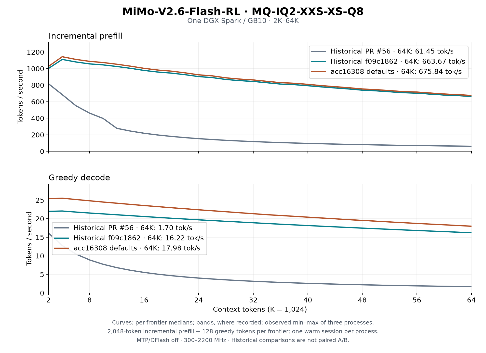

# MiMo runtime optimization, 2026-09-24

Fresh processes on DGX Spark / GB10. The four-shard
`MiMo-V2.6-Flash-RL-MQ-IQ2-XXS-XS-Q8` artifact and prompt hashes are in
[`swa/workload.json`](swa/workload.json). One VMM weight owner stays resident;
paired checks use sequential workers with a fresh warmup before each
measured process. The curve protocol is recorded separately below. The
user clock range stays 300–2200 MHz; receipts record observed clocks.

## Final 2K–64K curve



The retained defaults (`acc16308`, same final binary as the A/B below)
were measured in three fresh processes: 2048-token incremental prefill,
128 greedy tokens at every frontier through 65536, one warm session per
process, MTP and DFlash off. All 96 frontier rows completed. Busy SM clocks
were 2184–2190 MHz within the unchanged 300–2200 MHz policy.

| Metric | Historical f09c1862 | Retained defaults | Historical change |
| --- | ---: | ---: | ---: |
| 64K incremental prefill, tok/s | 663.67 | 675.84 | +1.83% |
| 64K plain decode, tok/s | 16.22 | 17.98 | +10.85% |
| Median run-mean prefill, tok/s | 854.95 | 874.46 | +2.28% |
| Median run-mean decode, tok/s | 18.96 | 21.47 | +13.25% |

These historical comparisons are not same-hour A/B. The fresh paired
8K/32K results appear below. Curves show per-frontier medians; bands use
recorded min/max only. The historical f09c1862 JSON has no band data.
[Measurements and hashes](curve/mimo2-prefill-2k-64k-20260924.json) ·
[Receipt](curve/receipt.json) · [Plot script](plot-final.py).

Rebuild the graph with `python3 plot-final.py` from this directory
(requires matplotlib). The three final CSVs and historical median JSON
are in `curve/`; the earlier PR #56 CSVs stay in the September 23 report.

## Round 1: share the SWA decode window

The previous walk loaded each KV head once per query head. The shared tile
loads it once for eight query warps, using vector copies. It is now the
default for one-row, window-128, eight-KV-head attention.
`DS4_MIMO2_SWA_DECODE=0` restores the walk;
`DS4_MIMO2_SWA_VEC=0` keeps the shared tile with scalar copies.

8,192 prompt tokens / 128 greedy output tokens, embedded MTP disabled
(`--mtp-draft 1`), no DFlash:

| Metric | Walk | Shared vector tile | Change |
| --- | ---: | ---: | ---: |
| Median prefill, tok/s | 1156.33 | 1154.55 | −0.15% |
| Median decode, tok/s | 21.30 | 23.08 | +8.36% |
| SWA kernels, profiled seconds | 0.599403 | 0.120262 | −79.94% |

Three samples per side; [`compare.json`](swa/compare.json) records the
sample envelope. Profiles are separate runs and are not used as application
throughput samples. The baseline and candidate use the same frozen binary;
[`receipt.json`](swa/receipt.json) records its hash and dirty source base.
Candidate and clean-build measurements are kept separate.

### Numerical contract

Prefill frontier logits are exact. The 128-token Italian continuation
changes 94 token positions starting at index 31; both continuations remain
coherent. This is **not** exact token parity. Three short math, Python and
Korean prompts produce identical correct answers. These are focused checks,
not a statistical quality benchmark.

The attention test compares with independent FP64 softmax using random
nonzero sinks, a 259-row ring, and positions through 262144. Maximum walk
versus tile difference is 1.79e-7; both oracle errors stay below 4.73e-7.
One captured graph is replayed with changed device positions. This bounds
the observed FP32 rounding and checks ring indexing. The attention consumer
does not write KV. The MiMo engine remains eager; no new model-level CUDA
graph capture path is introduced.

Focused tests (use the CUDA architecture appropriate to the test host):

```sh
nvcc -O3 --use_fast_math -std=c++17 -arch=sm_121a tests/mimo2_swa_quality.cu -o /tmp/mimo2-swa-quality
/tmp/mimo2-swa-quality
nvcc -O3 --use_fast_math -std=c++17 -arch=sm_121a tests/mimo2_decode_rounds.cu -o /tmp/mimo2-decode-rounds
/tmp/mimo2-decode-rounds
cargo test -p ds4-perf
```

## Round 2: parallel decode routing

The old router computes sigmoid in parallel, then scans all 256 experts
eight times on one thread. That serial selection accounts for 5.9% of
decode kernel time after round 1. A warp now reduces the comparisons for
widths 1–8. Ties choose the lowest expert ID; sigmoid, selected-weight
summation and the denominator floor preserve the previous arithmetic.
Wider prefill keeps the previous dispatcher. `DS4_MIMO2_ROUTER_WARP=0`
restores serial selection.

The same 8K/128 protocol, with round 1 enabled on both sides:

| Metric | Serial selection | Warp selection | Change |
| --- | ---: | ---: | ---: |
| Median prefill, tok/s | 1154.40 | 1156.81 | +0.21% |
| Median decode, tok/s | 23.00 | 24.42 | +6.17% |
| Router kernels, profiled seconds | 0.314609 | 0.021011 | −93.32% |

All three 128-token streams match. The focused test checks random scores,
ties, denominator-floor inputs and nonfinite rejection at widths
1/2/8/32/129. IDs and finite weights match exactly; nonfinite inputs keep
the previous rejection values. Typical decode-width kernel time falls
from 52 to 4.3 µs in that test. Full-model timing includes dispatch overhead.

```sh
nvcc -O3 --use_fast_math -std=c++17 -arch=sm_121a tests/mimo2_router_warp.cu -o /tmp/mimo2-router
/tmp/mimo2-router
```

## Round 3: keep DFlash attention on the GPU

The old external-drafter path copied Q/K/V to the host, ran RMSNorm, RoPE
and three-pass attention there, then copied attention output back. The
baseline profile spends 6.47 of 14.82 decode seconds outside GPU work
(43.6%, including other host work and synchronization). The device path
normalizes and rotates Q/K in place and shares 32-key K/V tiles across
eight query warps. `DS4_MIMO2_DFLASH_CPU=1` restores the original C loops.

256 prompt / 64 output tokens, external DFlash, draft width 8. Both sides
use the SWA vector tile and serial router in the same frozen binary:

| Metric | Host attention | Device attention | Change |
| --- | ---: | ---: | ---: |
| Median prefill, tok/s | 517.88 | 518.86 | +0.19% |
| Median DFlash decode, tok/s | 4.41 | 6.97 | +58.05% |
| Profiled decode range, seconds | 14.819759 | 9.397574 | −36.59% |
| GPU coverage of decode range | 56.4% | 90.2% | +33.8 points |

Device attention takes 0.018145 seconds, RMSNorm 0.027456 and RoPE 0.074160
in the separate profile. The host baseline has no corresponding attention
CUDA kernel; the application measurement includes the removed host work.
All three 64-token streams and prefill frontier logits match exactly.
The [receipt](dflash/receipt.json) records hashes, controls and scope.

One additional 2K/64 pair exercises the full 1024-row drafter context:
2.25 → 5.15 tok/s, identical tokens. The clean release build with SWA and
router defaults also passes that CPU/GPU pair. The primitive test covers
widths 1/2/4/8, short and full windows, nonzero sinks and positions through
262144. Maximum host/device error is 2.53e-5; the host fallback is exact.
Target verification and accepted-prefix commit logic are unchanged.

**This is a DFlash-mode improvement, not a reason to enable DFlash.** A
same-binary, same-owner 256/64 plain-decode countercheck after fresh warmup
reaches 23.91 tok/s (one sample, versus three DFlash samples). DFlash is
still substantially slower on this workload. Further rounds prioritize
prefill and ordinary decode.

```sh
nvcc -O3 --use_fast_math -std=c++17 -arch=sm_121a tests/mimo2_dflash_attn.cu -o /tmp/mimo2-dflash
/tmp/mimo2-dflash
```

## Practical round 2: emit SwiGLU directly into Q8

After the three rounds above, a separate three-candidate pass targets
ordinary inference. Practical round 1, dense Q8 CTA grouping, is rejected
below. In round 2, the profile attributes 4.5% of prefill kernel time to
SwiGLU and 5.2% to activation quantization. The routed down projection
previously wrote an F32 intermediate, then gathered and quantized it.
The fused emitter computes unweighted SwiGLU directly in the IQ2_XS
consumer's sorted D4 Q8 layout. Route weights still apply after down.

The capability is explicit: IQ2_XS down, 4096×2048, 256 experts, eight
assignments per token, widths 32–8192. Narrow decode keeps its old path.
`DS4_MIMO2_SWIGLU_Q8=0` restores materialization. The existing sanitation
diagnostic also retains the old path; no new finite-value repair is added.

| Metric | Materialized | Fused | Change |
| --- | ---: | ---: | ---: |
| Median 8K prefill, tok/s | 1156.08 | 1189.67 | +2.91% |
| Median plain decode, tok/s | 24.37 | 24.37 | 0.00% |
| 32768-assignment primitive, ms | 4.610593 | 2.521491 | −45.31% |

Three fresh processes per arm, ABBAAB order, fresh warmup before each,
SWA/router defaults on both sides. All six frontier logit vectors and
128-token streams match exactly. The primitive compares the production
SwiGLU plus canonical Q8 quantizer against the fused emitter at assignment
widths 1/8/256/1032/32768, including zero groups and reordered assignments;
all Q8 bytes match. See the [receipt](swiglu/receipt.json). A separate
profile reduces the prefill range from 7.104722 to 6.887643 seconds.
The sum of SwiGLU and MMQ activation-quantization kernels falls from
0.675470 to 0.475583 seconds (−29.59%, including the unaffected quantizers).
Profiles are not included in the three unprofiled samples.

```sh
nvcc -O3 --use_fast_math -std=c++17 -arch=sm_121a -Icuda/mmq tests/mimo2_swiglu_q8.cu cuda/mmq/quantize.o -lcudart -lcuda -o /tmp/mimo2-swiglu
/tmp/mimo2-swiglu
```

## Final retained build

Native source `acc16308`; benchmark SHA256
`ece7feabf85be6cf2ccfdb4913ec785bd968888e92bd2df43ff2692dfec0c84d`.
The same frozen executable runs every final control and default sample.
Controls disable the SWA tile/vector load, warp router and SwiGLU fusion;
all pre-existing prefill optimizations stay enabled on both sides.

| Workload | Metric | Controls | Defaults | Change |
| --- | --- | ---: | ---: | ---: |
| 8K/128, three samples | Prefill, tok/s | 1157.53 | 1191.45 | +2.93% |
| 8K/128, three samples | Plain decode, tok/s | 21.26 | 24.37 | +14.63% |
| 32K/128, one pair | Prefill, tok/s | 1032.29 | 1059.15 | +2.60% |
| 32K/128, one pair | Plain decode, tok/s | 18.67 | 21.02 | +12.59% |

The 8K order is ABBAAB with fresh warmup before each process. The 32K pair
is one additional check, not a three-run estimate. Prefill logits match
exactly at both lengths; repeated runs within each 8K arm also match all
tokens. Cross-arm generation reflects the SWA rounding change: 94/128
positions differ from index 31 at 8K; 111/128 from index 17 at 32K.
The [32K continuations](integration/32k-continuations.txt) are readable
Italian with different story details; the candidate also repeats a dialogue
phrase. This is not a quality-equivalence claim. The earlier focused
math/code/Korean checks bound the observed SWA change.

The retained DFlash CPU/GPU regression pair at 2K/64 gives 2.22 → 5.31
tok/s, identical frontier logits and all 64 tokens. No further DFlash
optimization was attempted. [Integration receipt](integration/receipt.json).

## Rejected candidates

A compact IQ2 gate/up activation layout removed eightfold repeated input
quantization and passed byte-exact gate/up tests. Three fresh 8K/128 samples
changed median prefill by +0.48% and decode by −0.84%. The ds4-perf verdict
was [`Pass`, not `Improved`](rejected-compact-q8.json); the gain did not
justify adoption. The compact
layout is absent from this branch.

The additional plain-decode profile attributes 57.9% of kernel time to
aligned dense Q8 GEMV. Grouping 2/4/8/16 output rows per CTA preserved
arithmetic but slowed seven production or ragged shapes by roughly 1–4%.
The original warp-per-row path already sustains roughly 260–280 GB/s.
This practical round 1 candidate was rejected before model integration;
[primitive timings](dense-group-probe.txt) do not claim an end-to-end gain.

Practical round 3 fused QKV split/RoPE with F16 KV storage. It removed
intermediate K/V writes and a launch, with exact Q/cache bytes at heads
4/8 and widths 1/8/129/4096, including changed-position graph replay.
Three fresh 8K/128 pairs measured prefill 1191.21 → 1195.51 tok/s
(+0.36%) and decode 24.36 → 24.41 (+0.21%). All logits and tokens match.
Neither latency envelope crosses ds4-perf's 1% improvement threshold;
the [candidate was rejected](qkv/receipt.json). Its production path and
switch are absent from this branch. The retained practical change is
SwiGLU → Q8; the three-candidate pass is complete.

## Reproduction

Build CUDA for the target device, then `make ds4-bench-perf`. Use the
[weight-owner protocol](../../../misc/proof-harness/README.md) and one
worker at a time. DFlash needs **both base and drafter** in the owner;
base-only import does not provide resident MTP tensors. Record the model,
prompt, binary and manifest hashes in the ds4-perf workload file.

```sh
export DS4_CUDA_WEIGHT_IPC_MANIFEST=/path/to/owner.ipc
./ds4-perf scout --out /path/to/result --collector nsys --proof \
  --repeats 3 --cache-policy warmup-then-fresh \
  --workload /path/to/workload.json -- \
  ./ds4-bench-perf --cuda -m /path/to/model-00001-of-00004.gguf \
  --prompt-file speed-bench/promessi_sposi.txt \
  --ctx-start 8192 --ctx-max 8192 --gen-tokens 128 --mtp-draft 1
```

Pass each diagnostic control to scout as `--env KEY=VALUE` before `--`.
For DFlash use `--mtp /path/to/DFlash-Q8_0.gguf --mtp-draft 8`, context 256,
and 64 generated tokens. Run a separate 2K case to exercise its full
1024-row context. Wrap the scout in `tools/host_memory_guard.py` with limits
fitted to the resident owner and host reserve. Profiles and unprofiled
throughput are separate processes. Three samples bound this session's
variation; they do not establish a broad workload average.

## Scope and validation

CUDA GB10 only. The model remains eager. No new captured-decode, bank,
media, disk-KV or long-context serving qualification is claimed here.
The 262144-position DFlash primitive test is a position/window check, not
a full-model 262K throughput run. SWA and router do not change prefill
selection; the SwiGLU fusion affects the fixed IQ2_XS prefill shape. DFlash
attention runs only when the external drafter is loaded.

Formatting, Clippy, all eight host parity targets, serialized workspace
tests and the all-target workspace check passed during the campaign.
The full model-free suite ran again during the practical candidate pass.
After rejecting QKV fusion, the retained CUDA production CLI/NVTX benchmark
was rebuilt and ds4-perf tests passed again. Standalone CUDA parity tests
cover all four retained paths. Metal was not tested.

A base-only-owner DFlash attempt lacked imported MTP ranges. A separate
local-MTP pilot had no funded MTP residency and failed with a CUDA memory
access error. Both were excluded. Retained DFlash runs use a replacement
owner exporting base and MTP, verified at 88.94 and 1.46 GiB of device
residency. The old owner exited before the replacement started.
