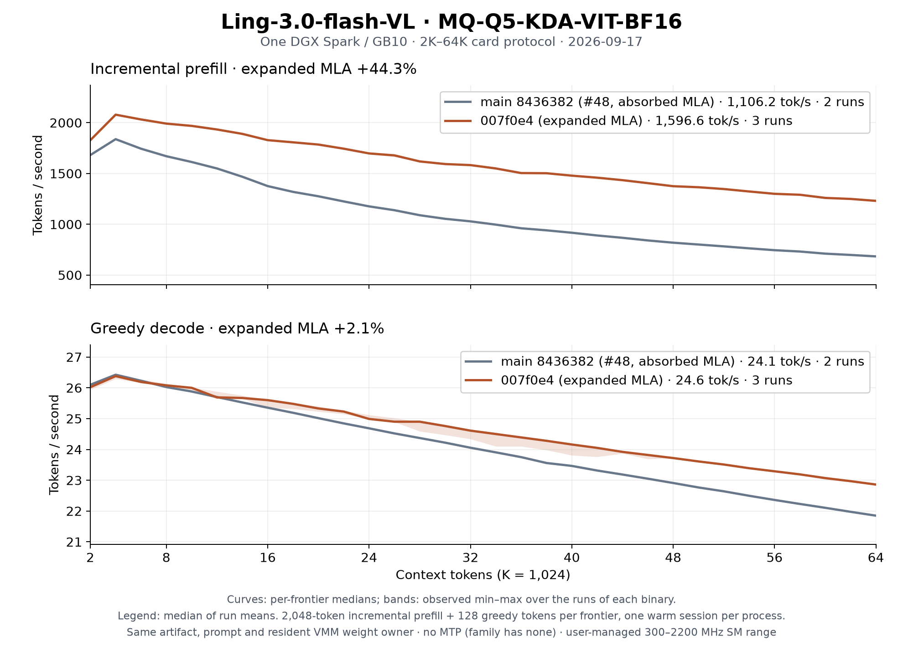

# Ling-3.0-flash-VL on DGX Spark

Ling-3.0-flash-VL is the eleventh family in `ds4-dfm-rs` and the fourth with
image input. It was sized deliberately against the
[Qwen3.8 Flash Next MQ-Q5](qwen38-ple-fp8.md) artifact so the same machine can
serve either one with the same operator surface.

The artifact is `Baekpica/Ling-3.0-flash-VL-Mixed-Quant-GGUF`, variant
`MQ-Q5-KDA-VIT-BF16`: three language shards plus one BF16 mmproj.

| File | Bytes | SHA-256 |
|---|---:|---|
| `Ling-3.0-flash-VL-MQ-Q5-KDA-VIT-BF16-00001-of-00003.gguf` | 29,750,367,328 | `6902566540c981273666d1df30ad88814a4f47e6d4fefbb3e50a4b4c49d84010` |
| `Ling-3.0-flash-VL-MQ-Q5-KDA-VIT-BF16-00002-of-00003.gguf` | 29,984,497,152 | `5c989b2ebe7af8f1d4c6415145ff659c9717e418d5ff642d94228fef83b8018c` |
| `Ling-3.0-flash-VL-MQ-Q5-KDA-VIT-BF16-00003-of-00003.gguf` | 23,492,477,536 | `20f983e7c3fa888f9a6f4e4784029bc9bbe23b17b22467cd3ac94d42ae5c2f66` |
| `mmproj-Ling-3.0-flash-VL-BF16.gguf` | 878,174,368 | `2a8033028450df21c86ece76d526488d62f6b5065dc239787f572a2e46ede79e` |

917 language tensors, 83,220,797,312 bytes of tensor payload at 5.3512
effective bits per weight; 334 vision tensors. Nothing else is accepted: the
host checks every tensor's name, rank, dimensions and quantization type, the
three-shard split identity, and the metadata listed below.

## Architecture

The GGUF architecture is `bailingmoe3`. 42 blocks, width 2560, vocabulary
157,184, `rms_norm_eps` 1e-6, native context 131,072.

### Hybrid attention

`layer_group_size` is 6, so a block is full attention when `(bid + 1) % 6 == 0`.
Blocks 5, 11, 17, 23, 29, 35 and 41 are MLA; the other 35 are recurrent KDA.
The GGUF carries this as a per-block `attention.head_count_kv` array of 1 and 0.

**KDA blocks.** 32 heads of 128. `attn_q`, `attn_k` and `attn_v` each project
2560 → 4096 and pass through a causal depthwise conv1d of width 4 followed by
SiLU; `q` and `k` are then L2-normalized. `ssm_f_a` is the decay projection and
`ssm_g_a` the output gate, both full rank because `no_kda_lora` is set — there
is no `_b` factor as there is on GLM 5.3. The decay is
`kda_gate_lower_bound * sigmoid(ssm_a * (ssm_f_a·x + ssm_dt))` with
`kda_gate_lower_bound` = -5.0, and `ssm_a` is stored already exponentiated in
this artifact rather than as `A_log`. The gated delta rule then runs over a
128×128 recurrent tile per head, and `ssm_norm` applies a per-head RMSNorm
before the sigmoid output gate.

**MLA blocks.** 32 heads, `qk_nope_head_dim` 128 + `qk_rope_head_dim` 64 =
192, `v_head_dim` 128, `kv_lora_rank` 512. `attn_k_b` is absorbed into Q so
attention scores against the stored 512-wide latent directly, and `attn_v_b`
expands the latent output back to 128 per head. `attn_gate` is a head-wise
sigmoid applied before the output projection.

### Routing

512 routed experts of width 768, top-8, plus one always-active shared expert.
The router is sigmoid with a selection-only correction bias
(`exp_probs_b.bias`), grouped into 8 groups of 64 of which the best 4 are kept
— ranked by the sum of each group's two best biased scores. The emitted
weights are the *unbiased* sigmoid probabilities, renormalized over the
selected eight and scaled by `routed_scaling_factor` 2.5.

SwiGLU clamps apply near the top of the stack and the two schedules differ:
the routed clamp is 4 for blocks 35–41, while the shared-expert clamp is 5 for
blocks 34–39 and 7 for blocks 40–41. A clamp bounds the SiLU output above and
the up projection on both sides.

### Positions

The VL wrapper uses M-RoPE with `mrope_section` `[8, 12, 12]`: the 32 rotary
pairs split contiguously into a temporal, a height and a width section. Pairs
are adjacent — `(2j, 2j+1)` — matching `rope_interleave`, not the half-offset
NeoX layout. `rope_theta` is 6e6.

Text rows set all three axes to the same index, so text reduces exactly to 1-D
RoPE. An image span of merged grid `H × W` places `t = base`, `h = base + y`,
`w = base + x`, and the rows after it resume at `base + max(H, W)` — the span
costs the larger of its two axes, not its token count.

### Vision

The tower is a Qwen3-VL ViT: 27 blocks of 1152 with 16 heads, FFN 4304, fused
QKV, LayerNorm with bias, `gelu_pytorch_tanh`, patch 16, 2×2 spatial merge and
a 2304-entry learned position table sampled bilinearly on its 48×48 grid.
There are no deepstack taps. It is structurally the same encoder Qwen3.8 Flash
Next already runs here, so it reuses those operators; three things differ:

- the weights are BF16/F32 rather than Q8_0;
- the Conv3D patch embedding is split along the temporal axis into two
  tensors, and a still image feeds both halves the same pixels;
- `disable_merger_proj` moves the projection out of the merger, so the merger
  is a norm plus the top-level `linear_proj` pair, emitted as `mm.0` and
  `mm.2` with a GELU between them.

Preprocessing is the factor-32 smart resize with CLIP normalization
(`image_mean` `[0.48145466, 0.4578275, 0.40821073]`, `image_std`
`[0.26862954, 0.26130258, 0.27577711]`) and this processor's own pixel budget:
`min_pixels` 4096, `max_pixels` 4,194,304.

## What the runtime reuses

Only five operators are family-specific: the grouped sigmoid router, the
M-RoPE, the BF16 MLA absorb pair and the per-head K/V expansion. Everything
else is an existing path.

| Stage | Source |
|---|---|
| KDA recurrence, chunked prefill and banked decode | Solar/GLM kernels, third variant |
| MLA prefill (64+ rows): per-segment BF16 K/V expansion, 192/128 range attention, LSE merge | Motif-3 full-attention split, cuBLAS batched GEMM; Ling range kernel (Motif's with BF16 K/V, 64-key tiles, ldmatrix) |
| MLA decode: absorbed latent attention | Motif-3 `latent_attention_bf16` (head-group split) |
| Routed expert GEMMs, expert sum, SwiGLU clamp, head-wise gate | Step 3.7 |
| ViT blocks, merger GELU/bias | Qwen3.8 Flash Next |
| Batched prefill workspace | shared `exaone_batch_ws` |

The SwiGLU clamp needed no new kernel: Step's operator already clamps the SiLU
output above and the up projection on both sides, which is exactly this
family's form.

## State and memory

The per-layer state is not uniform, and that is the interesting property.

- Each of the 35 KDA blocks owns a fixed 128×128 recurrent tile per head plus
  three convolution rings. That is 76.6 MiB for the whole model and it does
  not grow with context.
- Each of the 7 MLA blocks owns a linear BF16 latent cache of 576 values per
  token: 8,064 bytes per token for the model.

At 65,536 tokens that is 504 MiB of latent cache against 76.6 MiB of recurrent
state. A 131,072-token context costs about 1 GiB of KV; 262,144 costs
1.97 GiB per bank, plus recurrent state and prefill workspace.

A recurrent block's history *is* its state, so a rewind is not a truncation:
both hosts drop the whole checkpoint and the next sync replays the prefix.

## Serving

### YaRN 256K

`-c 262144 --max-seqs 2` selects static YaRN factor 2 for every session and
bank. Contexts through 131,072 preserve the original M-RoPE table; larger
contexts through 262,144 use the
[official Ling recipe](https://huggingface.co/inclusionAI/Ling-3.0-flash-VL#run-inference):
theta 6,000,000, 64 rotary dimensions, beta 32/1 and original context 131,072.
The interpolation ramp and `1 + 0.1 * ln(2)` amplitude apply to the rotated
Q/K tails; the nonrotary MLA dimensions keep their original scale.

The requested context fixes the table, including for short prompts. Serial
session rightsizing stays above 131,072 on a YaRN boot, so image requests keep
the same factor as the text banks. Contexts above 262,144 are rejected. Disk
restores require the same YaRN factor and reject mismatches before reading
cached tensors.
The native artifact metadata remains 131,072. Runtime capacity is separate
from the measured qualification reported by `--print-plan`.

### Launch

```sh
MODEL_DIR=/path/to/Ling-3.0-flash-VL-Mixed-Quant-GGUF/MQ-Q5-KDA-VIT-BF16

./ds4-server --cuda \
  -m "$MODEL_DIR/Ling-3.0-flash-VL-MQ-Q5-KDA-VIT-BF16-00001-of-00003.gguf" \
  --vision "$MODEL_DIR/mmproj-Ling-3.0-flash-VL-BF16.gguf" \
  --model-id Ling-3.0-flash-VL \
  -c 262144 --max-seqs 2 \
  --kv-disk-dir /var/lib/ds4/ling-kv \
  --host 127.0.0.1 --port 8000
```

The operator surface is the one in the [serving contract](serving-contract.md):

| Option | Ling |
|---|---|
| `--max-seqs` | persistent banks, no opt-in switch |
| `--kv-disk-dir` | session and per-bank payloads, `LNG3` layout |
| prefix reuse | exact fork, and partial fork from the recurrent checkpoint pool |
| image input | PNG/JPEG data URIs, user messages, at most four per request |
| MTP | none — this architecture has no NextN predictor |

`DS4_LING3VL_PREFILL_CHUNK` pins the prefill chunk (default 4096, max 4096).
`2048` restores the previous width.
`DS4_LING3VL_NO_MLA_EXPAND=1` restores absorbed-MLA prefill (dots3 HMMA).
`DS4_LING3VL_MLA_KV_F32=1` restores FP32 K/V scratch, one-chunk segments and Motif's range kernel.
`DS4_LING3VL_NO_MLA_HMMA=1` restores Motif HG MLA on absorbed prefill.
`DS4_MOTIF3_ATTN_HG_FILL=1` restores the fixed 32-way decode attention split.
`DS4_LING3VL_NO_BF16_REUSE=1` reconverts RMSNorm rows on every BF16 GEMM.
`DS4_LING3VL_NO_BF16_VEC=1` restores cuBLAS for n=1 BF16.
`DS4_LING3VL_NO_BF16_PAIR=1` keeps two n=1 BF16 GEMVs.
`DS4_LING3VL_NO_GEMV_XREG=1` restores the streaming n=1 warp GEMV.
`DS4_MMQ_Q5_PAIR=0` restores two n=1 Q5_K routed gate/up GEMVs.
`DS4_MMQ_VEC_SANITIZE=1` keeps the Q4_K/Q5_K decode mmvq finite-scrub.
`DS4_LING3VL_NO_F32_VEC=1` restores the 256-thread n=1 F32 GEMV.
`DS4_SERVER_FORK_PARTIAL=0` drops the checkpoint pool, leaving exact fork only.

### CUDA campaign (GB10)

Workload: 8192+64, `speed-bench/promessi_sposi.txt`, SM 2184–2197 MHz.
Baseline `ds4-bench`: prefill 1142 tok/s, decode 19.54 tok/s.
After the counted rounds: prefill 1889 / 1893 tok/s, decode 24.65 tok/s.

Counted `ds4-perf compare --regression` Improved:

| Round | Change | Kill | Result |
|---|---|---|---|
| P1 | Prefill MLA dots3 HMMA | `DS4_LING3VL_NO_MLA_HMMA=1` | +50.7% prefill |
| P2 | Prefill chunk 4096 | env `2048` | +7.8% prefill |
| P3 | Pack RMSNorm once for BF16 GEMM | `DS4_LING3VL_NO_BF16_REUSE=1` | +2.7% prefill, exact logits |
| D1 | n=1 BF16 warp GEMV | `DS4_LING3VL_NO_BF16_VEC=1` | +25.3% decode |

Kept, not Improved (extrema envelope missed or flat): pair GEMV,
register-cached GEMV (`NO_GEMV_XREG`), n=1 Q5_K gate/up pair,
skip decode mmvq finite-scrub. Decode after D1 is still ~70% BF16 GEMV
plus mmvq; further inner-loop and fused-mmvq attempts did not clear 1%.

Tests: `tests/test_ling3vl_mla.cu`, `tests/test_ling3vl_matmul.c`,
`tests/test_ling3vl_q5pair.c`.

### Long-context rounds (2026-09-17)

The absorbed MLA prefill was the term that grew with context: at 64K the
dots3 HMMA kernel held 52% of a cold prefill's kernel time at 32 TFLOPS,
because every block scores 32 heads against one shared 576-wide latent row
(1,088 FLOPs per head-key) and re-streams every key tile per token.  P4
takes the split Motif-3 runs on its full layers: each 4096-key latent
segment is expanded to per-head K (192) / V (128) by two BF16 batched
GEMMs, attended by the Motif 192/128 range kernel (320 FLOPs per head-key)
and merged through its log-sum-exp.  The 64K cold prefill's attention
share fell from 32.7 s to 8.7 s plus 0.8 s of merges.  D2 doubles the
decode head-group attention split until the grid covers GB10 twice: Ling's
two 16-head groups ran 64 CTAs on 48 SMs.

| Round | Change | Kill | Result |
|---|---|---|---|
| P4 | Expanded-MLA prefill, rows >= 64 | `DS4_LING3VL_NO_MLA_EXPAND=1` | 8K +15%, 64K +94% prefill |
| D2 | Decode HG split 32 -> 64 for two head groups | `DS4_MOTIF3_ATTN_HG_FILL=1` | 64K +4.5% decode, 8K flat |
| P5 | BF16 K/V scratch, 64-key tiles, 3-chunk segments | `DS4_LING3VL_MLA_KV_F32=1` | 8K +1.3%, 32K +8.3%, 64K +14.5% prefill |

Same-hour A/B, one warm session per fresh process, 8,192-token incremental
prefill and 128 greedy tokens per frontier, SM 2190–2197 MHz; `old` is
both kills set (the #48 path), `new` the median of two runs:

| Frontier | Prefill old → new tok/s | Decode old → new tok/s |
|---:|---:|---:|
| 8,192 | 1,884 → **2,176** (+15.5%) | 25.38 → 25.51 |
| 16,384 | 1,604 → **2,110** (+31.6%) | 25.37 → 25.56 |
| 32,768 | 1,127 → **1,800** (+59.7%) | 24.06 → 24.65 |
| 49,152 | 881 → **1,579** (+79.2%) | 22.89 → 23.70 |
| 65,536 | 723 → **1,401** (+93.7%) | 21.83 → 22.83 (+4.6%) |

Cold 65,536-token prefill: 1,048 → **1,742 tok/s**.  Frontier logits at all
eight frontiers keep the same argmax and 9–10 of the top 10; rel-RMS vs
the #48 path is 0.04–0.11, and vs the FP32 absorbed walk 0.114 where the
#48 FP16 HMMA path sits at 0.093 — the same class P1 was accepted in.  The
expanded path is deterministic (two runs byte-identical).  Decode still
loses 11% from 8K to 64K in the absorbed HG walk (1.24 ms per MLA layer at
64K against a 0.3 ms bandwidth floor); a tensor-core split-K decode kernel
is the open item.

**P5** (round 2, on top of the merged #49).  The range kernel was profiled
against the tensor roof rather than the memory it moves: GB10's dense BF16
rate with FP32 accumulation is ~54 TFLOPS and the Motif kernel held ~42.
Model-free A/B on one 4096 x 4096 segment at position 61,440 (ms):
Motif FP32 9.7; BF16 K/V + ldmatrix at TK=32 9.6 (the staging bytes were
not the bound); TK=64 8.2; eight warps per block 10.1 (166 registers
force one CTA per SM); one softmax update per tile 8.4.  What ships:
BF16 K/V written straight by the expansion GEMMs, the Ling range kernel at
TK=64 with ldmatrix fragments, and three-chunk key segments (the BF16
scratch fits 12,288 keys in the same aliased buffer), so the LSE merges
drop 3x.  Same-hour A/B on 8,192-token frontiers, `old` = `#49` path:

| Frontier | Prefill old → new tok/s | Decode |
|---:|---:|---:|
| 8,192 | 2,201 → **2,229** (+1.3%) | 25.6 → 25.5 |
| 32,768 | 1,812 → **1,963** (+8.3%) | 24.6 → 24.6 |
| 65,536 | 1,408 → **1,613** (+14.5%) | 22.8 → 22.8 |

Frontier logits keep the same argmax at all eight frontiers (8–10/10
top-10; rel-RMS 0.04–0.085 vs the #49 path from the segment-boundary
reorder, bit-identical at 8K where one segment covers the prompt); two
runs are byte-identical.  Eight-warp query tiles were measured and not
shipped.

Tests: `tests/test_ling3vl_mla_expand.cu` (FP32 and BF16 expanded scratch
vs absorbed vs a double reference across a three-segment merge; rel-RMS
6.4e-3 on both range kernels from the BF16 operand rounding, 5e-7 for the
absorbed walk).

### 2K–64K card sweep (2026-09-17)

The Qwen card protocol: one warm session per fresh process, 2,048-token
incremental prefill and 128 greedy tokens at every frontier from 2,048 to
65,536, `speed-bench/promessi_sposi.txt`, a resident VMM weight owner,
SM 2177–2190 MHz while busy.  Two runs of `main` `8436382` (#48), three
of `007f0e4` (#49) and three of `3d7078b` (#50; merged as `f35dbeb`).
#48 and #49 shared one owner; #50 used a fresh owner of the same
artifact later the same morning.  Between frontiers `ds4-bench` replays
the prefix (the recurrent state has no rewind); that replay sits outside
both measured phases.



| Binary | Runs | Mean prefill tok/s | Mean decode tok/s |
|---|---:|---:|---:|
| `8436382` (#48, absorbed MLA) | 2 | 1,106.2 | 24.05 |
| `007f0e4` (#49, expanded MLA) | 3 | 1,596.6 (+44.3%) | 24.56 (+2.1%) |
| `3d7078b` (#50, BF16 K/V, 64-key tiles) | 3 | **1,735.6** (+56.9%) | **24.53** (+2.0%) |

Per-frontier medians, #48 → #49 → #50 (deltas vs #48 / vs #49):

| Frontier | Prefill tok/s | Decode tok/s |
|---:|---:|---:|
| 8,192 | 1,670 → 1,991 → **2,048** (+23% / +2.8%) | 26.0 → 26.1 → 26.1 |
| 32,768 | 1,029 → 1,583 → **1,736** (+69% / +9.7%) | 24.1 → 24.6 → 24.6 |
| 65,536 | 684 → 1,231 → **1,423** (+108% / +16%) | 21.9 → 22.9 → 22.8 |

Prefill still declines 2K → 64K (1,836 → 1,423): the seven MLA layers
are dense causal full attention, so the leftover slope is key-range
traffic.  Decode declines 26.0 → 22.8 in the absorbed head-group walk.
Raw CSVs, `receipt.json` and `summary.json`:
`benchmarks/ling3-flash-vl-2026-09-17/`; plot:
`python3 docs/benchmarks/plot-ling3-flash-vl.py` (matplotlib).

Chat input runs the official Bailing V3 Jinja template that ships in the GGUF;
the legacy token builder refuses this family rather than approximating it. The
generated tool envelope is GLM's `<tool_call>` / `<arg_key>` / `<arg_value>`
XML, and thinking is `<think>` / `</think>`.

### Partial reuse

Partial reuse costs one constant snapshot rather than a per-token window. The
latent caches are append-only, so a fork copies rows `[0, pos)` straight from
the source bank; only the recurrent state has no rewind and needs the
checkpoint slab, which reserves 32 slots of 76.6 MiB and maps them on demand.

A fork needs somewhere to land. A held source bank can still be forked, but
only into a free or evictable one, so with every bank holding a live
conversation the probe is refused and the turn prefills cold. `--max-seqs` is
the reuse budget as much as the concurrency budget; this is the shared
bank-budget refusal, not a family limit.

## Scope

Qualified on one DGX Spark with CUDA, measured at 8,192 context with two
banks: cold prefill 1,461 tok/s over 1,072 tokens, decode 19.8 tok/s, a
second turn reusing 1,123 of 1,146 prompt tokens by fork, and a disk record
restoring 1,153 of 1,173 into an empty bank after a restart. `ds4-bench`
throughput is measured through 65,536 tokens in one warm session (the
sweep above).

YaRN checks on GB10 / CUDA 13.3 (2026-09-17), with the artifact above:
two simultaneous cold HTTP requests at `-c 262144 --max-seqs 2`, each with
262,016 input tokens and 32 output tokens, completed in 523.6 / 523.9 seconds
on the continuous lane (`served=2 fallback=0`). Short math and image requests
returned `5` and `Red`; the image session kept factor 2 after rightsizing.
At the same serving profile, a separate chat fixture reused 13,160 of 13,186
tokens by fork, then restored 13,188 of 13,214 from disk after a restart.
Native payload restore from context 131,073 to 262,144 preserved all 157,184
logits before and after 16 greedy tokens following a 512-token prefix;
cross-factor restore and context 262,145 were rejected.

At context allocation 131,072, a fresh-process A/B against `c29dc41` retained
all 157,184 frontier logits for `promessi_sposi.txt` 8,192+64. A separate CLI
run retained 64 greedy tokens and their top-8 logits/logprobs. Prefill was
2209.36 / 2206.30 tok/s and decode 24.83 / 25.04 tok/s (base / YaRN build,
SM 2184–2197 MHz); this single A/B establishes parity, not a speedup.

Not release gates and not implied: Metal, ROCm, CPU inference, distributed
slices, DSpark sidecars, directional steering, speculative decoding, video
input, or long-context task quality. These checks do not change the 65,536-token
qualification marker in the serving plan.
