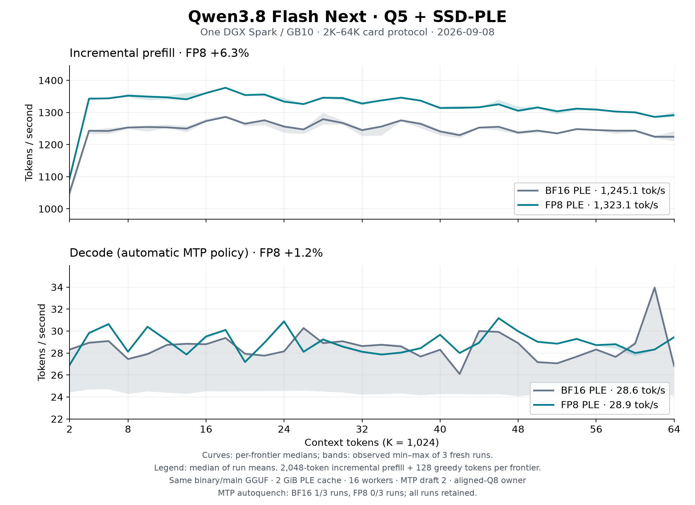
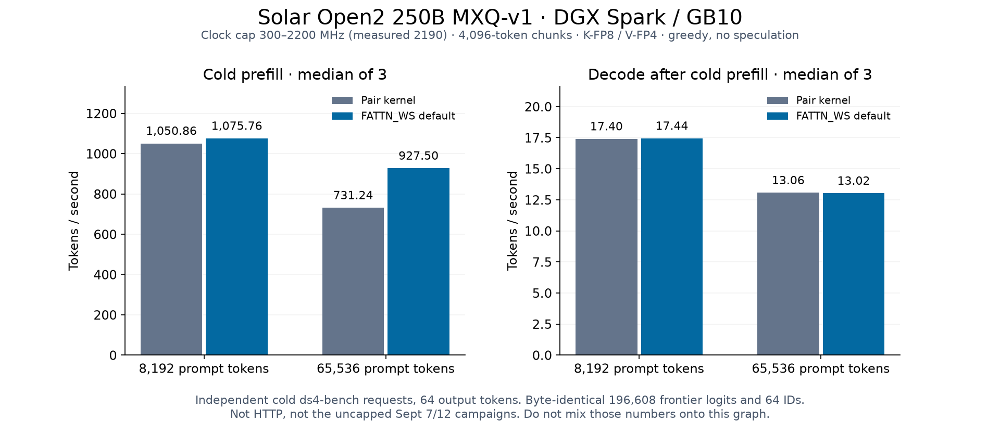
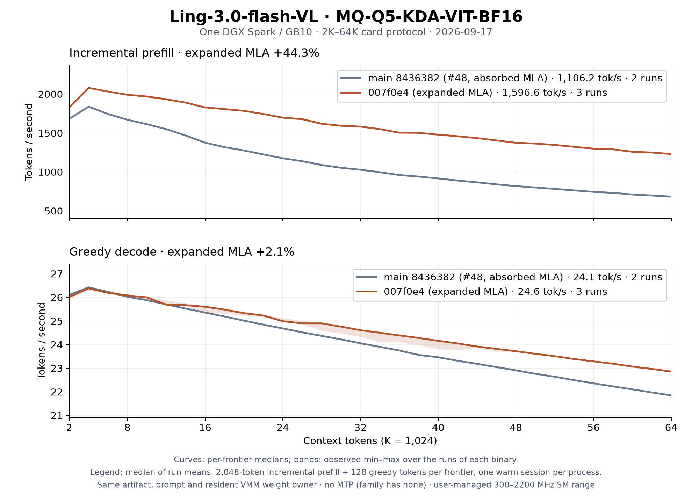

# Performance references

The [README table](../README.md#performance-and-release-evidence) presents
recorded whole-model prefill and decode examples. This guide explains their
conditions and links to the original reports. Workloads, clocks, artifacts and
sampling differ between rows; use the original protocol for a comparison.

Rates are tokens/second. `K` means 1,024 tokens; `8K + 64` means 8,192 input
tokens and 64 generated tokens. Prefill processes the prompt; decode generates
the continuation. A sweep with reused state measures incremental suffixes,
while a cold request computes the whole prompt. MTP changes the decode workload.
Throughput does not establish context, bank, cache or media qualification.

## Qwen

Qwen3.8 Flash Next Base Q5 on one DGX Spark / GB10, with only the SSD-PLE
format changed. The [FP8 PLE guide](qwen38-ple-fp8.md#reproduce-the-card-sweep)
owns the exact command, identities, paired results and numerical limits.

| PLE format | Prefill tok/s | Decode tok/s |
|---|---:|---:|
| BF16 | 1,245.1 | 28.59 |
| FP8 | 1,323.1 | 28.93 |

These cells are medians of three run means over 32 frontiers, from 2K to 64K.
Each process uses one warm session, 2,048-token incremental prefills and 128
greedy outputs per frontier. The same frozen binary and aligned-Q8 owner serve
both formats, with a 2 GiB PLE cache, 16 page workers and an 8,192-token chunk cap.

Curves show per-frontier medians; bands show observed min/max, not confidence
intervals. MTP draft 2 was requested; one BF16 run autoquenched and remains in
the data. FP8 changes embedding values and can change tokens and draft
acceptance. This is the recorded automatic-policy result, not an isolated MTP
speedup or a cold 64K/256K serving measurement.

Source: [paired results and verification](qwen38-ple-fp8.md),
[raw CSVs and receipt](benchmarks/qwen-ple-fp8-2026-09-08/).

Later cold-prefill and draft/prefix campaigns retain their own protocols:
[September 6](qwen38-prefill-2026-09-06.md),
[September 7](qwen38-prefill-2026-09-07.md),
[September 14](qwen38-perf-2026-09-14.md).

### Qwen Uncensored

The same [paired card sweep](qwen38-ple-fp8.md#reproduce-the-card-sweep) records
1,310.8 prefill / 28.96 decode for Uncensored Q5 with FP8 PLE. It is a separate
main model, measured with the same protocol. The README graph shows Base Q5.
Swift's card reuses the Base Q5 graph as a reference; no Swift throughput is
reported here.

## Solar

Solar Open2 250B MXQ-v1, one GB10, cold `ds4-bench` requests, 64 greedy outputs,
4,096-token chunks, MTP off. The [September 14 round 2](solar-open2-optimization-2026-09-14.md#round-2-skip-redundant-q3-handoff-down-sanitize)
records 1,095.61 prefill / 17.43 decode at 8K and 943.18 / 13.01 at 64K.
Both are medians of three interleaved comparisons under the 300–2200 MHz
clock range; sampled SM clocks were 2190 MHz. Logits and IDs matched byte for byte.

The curve shows the separate round-1 FATTN_WS off/on comparison. The README
uses the later round-2 result. These are cold benchmark requests, distinct
from HTTP reuse and the earlier uncapped campaigns. Keep the recorded clock
conditions when reproducing the result.

## Motif

Motif-3 MQ87-88's [August 21 C baseline](model-family-history.md#motif-3-remesure-on-the-v062-dfm-line-2026-08-21)
records 627.19 prefill / 15.06 decode at 8K + 64 on GB10. It uses a 4,096-token
chunk, aligned-Q8 VMM owner, greedy non-thinking generation and no speculation.
This is inherited `v0.6.2-dfm` evidence, not a fresh Rust-host measurement.

## dots3

dots3-note MQ87's [September 6 campaign](dots3-optimization-2026-09-06.md)
records 604.3 prefill / 16.78 decode at 8K + 64, serial plain decoding on GB10.
The same-binary kill-switch comparisons preserve the frontier argmax, top-10
and all 64 greedy IDs. The result does not qualify later opt-in banks or MTP.

## K2

K2-Horizon MQ87's [September 5 continuation scoreboard](k2-optimization-2026-09-05-cont.md#scoreboard)
contains two all-default round-6 samples: 644.78 / 13.34 and 641.94 / 13.07
prefill/decode. The README retains their ranges rather than selecting the faster
sample. These are fresh GB10 processes, 8K + 64, context 8,257, no MTP or reuse.
The report defines the accepted arithmetic differences and clock conditions.

## Inkling

Inkling Small MQ85GB's [September 22 capped-clock result](inkling-optimization-2026-09-22.md)
records 452.58 prefill / 13.07 decode for the retained router tile. Workload:
cold 8K + 64, MTP off, chunk 2,048, three interleaved pairs on GB10. SM clocks
were 2190–2197 MHz. The higher unlocked-clock figures are a separate result;
contexts above 8K were not measured in this campaign.

## Step

Step 3.7 Flash MQ83's [capped-clock aggregate](step37-optimization-2026-09-13-r3.md#final-aggregate-ab)
records 1,194.64 prefill / 22.77 decode in the matched final 2K + 64 comparison.
It uses the Q8 MTP sidecar, draft 3, three fresh-process pairs and the same VMM
owner under a 300–2200 MHz GB10 clock range. Logits and tokens match exactly.
The separate 16K result changes the MTP trajectory and is not this table row.

## Ling

Ling-3.0-flash-VL MQ-Q5's [GB10 campaign](ling3-flash-vl.md#cuda-campaign-gb10)
records 1,889 prefill / 24.65 decode at 8K + 64 after PR #48, with busy SM
clocks 2177–2197 MHz. The family has no MTP. Later PR #49/#50 results use
different retained paths and are recorded separately.

This later card sweep uses one warm session per fresh process. Curves are
per-frontier medians; bands are observed min/max over two #48 runs and three
each for #49 and #50. The [raw CSVs and receipt](benchmarks/ling3-flash-vl-2026-09-17/)
retain the workload and artifact identities.

## MiMo

MiMo-V2.6-Flash-RL mixed quant's [September 26 round 3](benchmarks/mimo2-2026-09-26/README.md#gateup-bounded-scheduling)
records 1,217.76 prefill / 24.44 decode, medians of three fresh samples per arm.
Workload: 8K + 128, chunks 4,096, MTP/DFlash off, shared VMM owner, GB10 under
a 300–2200 MHz clock range. All 152,576 logits and 128 tokens match exactly.
The [media campaign](benchmarks/mimo2-media-2026-09-26/README.md) is separate.

### MiMo MOPD

The [September 30 MOPD round 2](benchmarks/2026-09-30-mimo2-mopd-spark.md#prefill-2-pipelined-down-worklists)
records 1,206.290 prefill / 24.180 decode for the retained ON path at 8K + 128.
Three rotated fresh-process rounds use chunk 4,096, a shared VMM owner and
MTP/DFlash inactive. Busy clocks were 2184–2190 MHz within the 300–2200 range.
The longer 8K + 1,024 check has equal OFF/ON decode medians; it does not reproduce
the short-decode decrease. This is a separate artifact and workload from RL.

## Naive

Naive-N0.5-Flash MQ87's [October 1 paired index result](benchmarks/naive-2026-10-01/README.md#p8-paired-index-score-query-reuse)
records 518.85 prefill / 18.85 ordinary decode for `index2-on` on GB10.
Three fresh processes per side use separate warmups, chunk 2,048 and 32
greedy outputs; all 915,456 checked logits and token/argmax decisions match
exactly. Sampled clocks are 2190–2197 MHz. Native source is `ee28ed26`;
the report pins each round's benchmark bytes and eager/actual-state proofs.
The [September 30 index-packing pair](benchmarks/naive-2026-09-30/index-pack.md)
remains historical. These results do not qualify DSpark acceleration or
long-context serving; use the [family guide](naive-n05-flash.md) for those limits.

## Bonsai

Prism Bonsai 2 27B PQ2_0's [September 30 prefill evidence](releases/bonsai-perf-2026-09-30.md#evidence)
uses an **RTX 4070 SUPER**, not GB10. Three fresh-server pairs on a 2,140-token
prompt with 64 outputs record mean prefill 1,023.3; the same tiled runs decode
at 18.00 / 17.50 / 18.00. The README reports that observed decode range.
Loaded clocks were 2775–2790 MHz. IDs matched the control.

The [later split-K report](releases/bonsai-splitk-2026-09-30.md) measures 15K/30K
workloads. Its decode figures are not combined with this earlier prefill row.

## Measuring and qualifying changes

- [ds4-perf](ds4-perf.md): inspection, profiling, paired comparisons and serving workloads.
- [Optimization playbook](prefill-decode-optimization-playbook.md): bottlenecks and numerical contracts.
- [Speed benchmarks](../speed-bench/README.md): manual sweeps and plot generation.
- [Contributing](../CONTRIBUTING.md#performance-and-profiling): fresh processes, matched settings and required proofs.

Use unprofiled timing for throughput; use profiler captures to explain the
execution path. Preserve the exact model, quant, prompt, cache state, context,
output, bank count and clock conditions. A kernel speedup alone does not
establish end-to-end improvement.

Release qualification remains in the [release ledgers](README.md#release-ledgers)
and [migration evidence](rust-migration/README.md). The original split matrix,
Qwen ABBA/soak, RC.3 serving checks, GLM smoke and K2 admission gates have their
own commits and workload limits. Historical PASS results do not qualify a
different artifact, a larger prompt or the current machine's live service.
