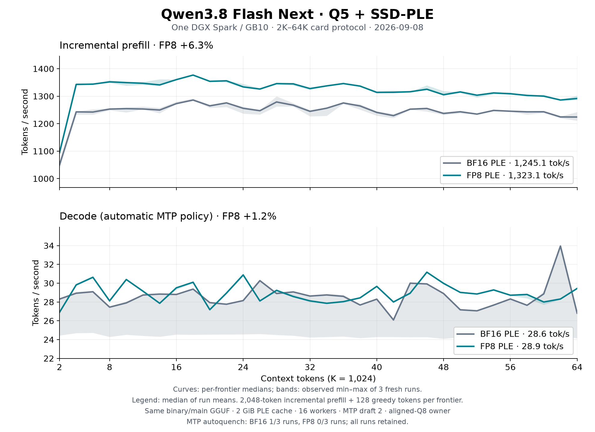
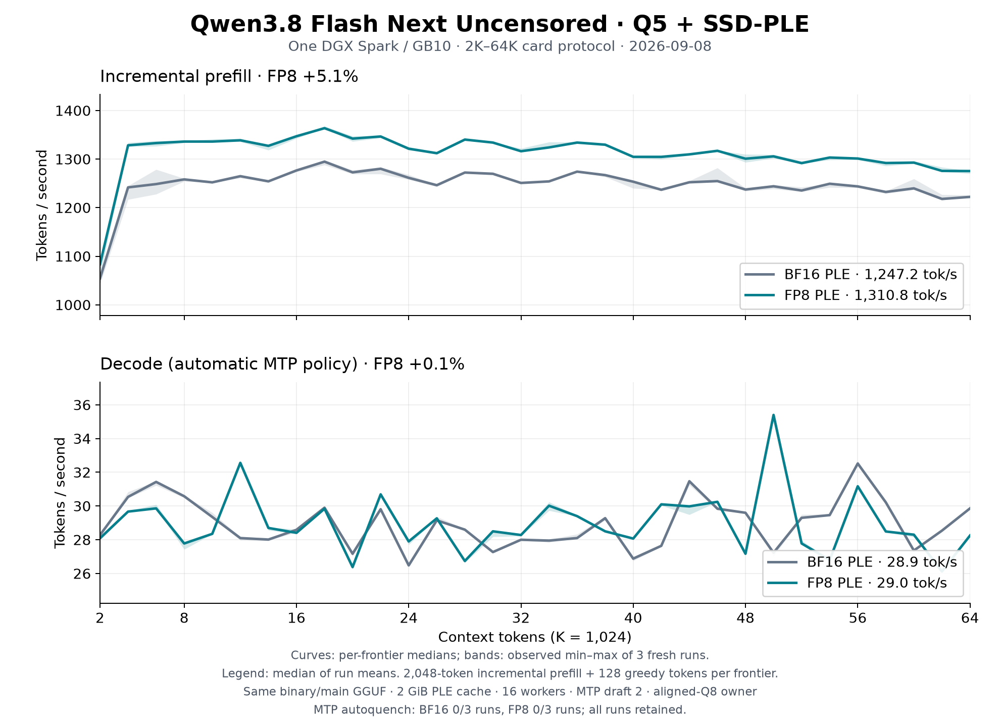

# Qwen FP8 PLE sidecar support

Existing Qwen3.8 Flash Next
[base](https://huggingface.co/Baekpica/Qwen3.8-Flash-Next-Mixed-Quant-SSD-PLE-GGUF) and
[Uncensored](https://huggingface.co/Baekpica/Qwen3.8-Flash-Next-Uncensored-Mixed-Quant-SSD-PLE-GGUF)
main GGUFs can select the
[official FP8 PLE sidecar](https://huggingface.co/Baekpica/Qwen3.8-Flash-Next-Mixed-Quant-SSD-PLE-GGUF/tree/main/PLE-FP8)
with `DS4_QWEN_PLE_DIR`. Main weights, model filenames and GGUF metadata stay
unchanged. Without the override, the runtime uses the existing BF16 sidecar.

```bash
export DS4_QWEN_PLE_DIR=/absolute/path/to/PLE-FP8
```

Use the same `ds4`, `ds4-server` or `ds4-bench` arguments as before. The selected
directory must contain `ple-manifest.json`, the four FP8 files and
`ple-fp8-weight-scale.bf16.bin`. A missing or unsupported selected sidecar is
an error. The startup log reports `dtype=FP8_E4M3FN` or `dtype=BF16`.
One FP8 directory can be shared by the base and Uncensored model directories.

The main GGUF packaging name `MQ-Q5-SSD-PLE-BF16` remains its published name;
it does not override this explicit runtime selection. Build the branch's
native backend and Rust executables with `make cuda-spark` on GB10.

## Storage and numerical contract

The files are extracted without requantization from
[`Qwen/Qwen3.8-Flash-Next-FP8@236dfdf285828023ca3bcd3f37366c58a3469b13`](https://huggingface.co/Qwen/Qwen3.8-Flash-Next-FP8/tree/236dfdf285828023ca3bcd3f37366c58a3469b13).
The Uncensored main model uses this same official PLE; it is not a PLE
extraction from a separate Uncensored FP8 checkpoint.

| Property | BF16 PLE | FP8 PLE |
|---|---:|---:|
| Manifest version | 1 | 2 |
| Stored row | 160 BF16 values / 320 bytes | 160 E4M3FN codes / 160 bytes |
| Four physical files | 102,400,786,432 bytes | 51,200,393,216 bytes |
| Additional scale | none | 2-byte BF16 scalar |
| Cache storage | BF16 pages | FP8 pages |
| Gather output | BF16 | BF16 |

V2 file paths are relative to the manifest directory. The loader validates
the official 128-part layout, 2,500,012 rows per part, aligned file offsets,
hash controls and shared scale bits `0x3951` (0.00019931793212890625).
The scale multiplies the decoded value; linear-layer block scaling does not
apply. The source result is `BF16(BF16(E4M3FN(code)) * BF16(scale))`.
A 256-entry BF16 lookup implements this exact conversion on both the CPU
reader and the FP8 CUDA gather. The existing BF16-to-FP32 promotion and
Q8 projection path then consume the same interface. The four files remain
compressed in the bounded 4 KiB page cache; there is no full-sidecar expansion.

The existing BF16 gather and downstream attention, GDN, MoE, MMQ and MTP
computations are unchanged. This landing adds storage compatibility and
measurement, with no worker-count, cache-size, prefill-chunk or kernel-tuning
campaign. FP8 values can differ from the existing BF16 PLE, so numerical
equivalence to the FP8 source is distinct from BF16-model quality equivalence.

## KV compatibility

Use a separate `--kv-disk-dir` for each main model and PLE format. BF16 and
FP8 snapshots describe different effective weights. The native payload tag
distinguishes the formats and rejects a cross-format restore; matching-format
serial and bank snapshots retain their existing layout and replay behavior.

## Reproduce the card sweep

Use one resident VMM weight owner for the selected main model, with aligned
Q8 artifacts. See the [weight-owner guide](../misc/proof-harness/README.md).
Keep its manifest in `DS4_CUDA_WEIGHT_IPC_MANIFEST` and set
`DS4_CUDA_WEIGHT_IPC_SCOPE=base`.

```bash
env CUDA_VISIBLE_DEVICES=0 \
  DS4_CUDA_WEIGHT_IPC_MANIFEST="$owner_manifest" \
  DS4_CUDA_WEIGHT_IPC_SCOPE=base \
  DS4_MEMGOV=observe DS4_SESSION_GRAPH_FIT=0 DS4_SESSION_GRAPH_HEADROOM_MB=0 \
  DS4_QWEN_PREFILL_CHUNK=8192 DS4_QWEN_PLE_CACHE_MB=2048 \
  DS4_QWEN_PLE_WORKERS=16 DS4_PLE_LATENCY_STATS=1 \
  DS4_QWEN_PLE_DIR="$fp8_directory" \
  ./ds4-bench --cuda -m "$main_gguf" \
    --prompt-file speed-bench/promessi_sposi.txt \
    --ctx-start 2048 --ctx-max 65536 --step-incr 2048 \
    --gen-tokens 128 --mtp-draft 2 --csv fp8.csv
```

For BF16, remove `DS4_QWEN_PLE_DIR` from the process environment. Keep all
other settings and the same binary. This is the existing model-card protocol:
one warm session, 32 frontiers, a 2,048-token incremental prefill and 128
greedy tokens at each frontier. It is not a cold 64K prefill or a 256K service
throughput measurement. Prefill includes embedded-MTP prefix maintenance.
The prompt SHA-256 is
`f53e0d80cb2d4492d24ebd63c7000c397b16ae70f9bf09b3763e5d8323ec209f`.

The measured implementation is [`84d183c`](https://github.com/Baekpica/ds4-dfm-rs/commit/84d183cadc5f0c99f7c40941947bcb19ab262ade),
with benchmark SHA-256
`423683df045ad27f12a19b1ca53b78c622f8258559a1805549a05984a6782046`.
All paired runs use this one frozen binary. The subsequent
[`2b7aee7`](https://github.com/Baekpica/ds4-dfm-rs/commit/2b7aee735d0c5a1f6e3204196588cf33149dd4be)
adds the KV format guard and brace/comment fixes; final live checks use that
commit. Snapshot save/restore runs outside the benchmark prefill/decode timers.
NVTX is disabled and no Nsight collector runs during these sweeps.
Existing PLE latency counters remain enabled, matching the prior card run.

Three fresh processes per format and model ran in alternating order:
BF16/FP8, FP8/BF16, BF16/FP8. All samples use the same 2 GiB cache, 16 page
workers, 8,192-token prefill cap and MTP draft 2. Curves show each frontier's
median; shaded ranges show the three observed samples, not confidence bounds.

| Main model | BF16 prefill | FP8 prefill | Change | BF16 decode | FP8 decode | Change |
|---|---:|---:|---:|---:|---:|---:|
| Base Q5 | 1,245.1 | 1,323.1 | +6.3% | 28.59 | 28.93 | +1.2% |
| Uncensored Q5 | 1,247.2 | 1,310.8 | +5.1% | 28.93 | 28.96 | +0.1% |

Throughput is tokens/second; each cell is the median of three arithmetic
means over the 32 frontiers. The CSV metrics are `prefill_tps` and `gen_tps`,
matching the original card plot.

MTP autoquench runs: `base-bf16-3`.





All repeats remain in the published data. Automatic MTP quenching can
change decode throughput; the results measure the existing automatic policy,
not an isolated FP8 arithmetic or MTP speedup. FP8 also changes embedding
values and can change generated tokens and draft acceptance.

For the base model, median whole-process PLE row-acquisition time decreased
from 9.709 to 5.808 seconds. Median physical reads decreased from
3,270,926,336 to 3,121,102,848 bytes (4.6%), despite the 50% smaller files:
reads still use 4 KiB pages. These counters include startup, prefill and
decode; they are supporting observations, not phase-attributed timings.

## Verification and evidence

- `make test-ple-formats`: model-free sparse-layout tests, all finite FP8
  codes, malformed scales/manifests, part/page boundaries and BF16 byte parity.
- `test_qwen4exp_batch`: serial/two-bank MTP token parity, disk KV, partial
  fork and graph lifecycle; opposite PLE tags are rejected and same-format
  state restores. Set `DS4_TEST_PLE_FP8=1` with the FP8 directory override
  when running this fixture against FP8.
- `test_qwen4exp_ple_cuda`: both formats, 4,112 rows, two CUDA streams and
  a minimum 16-page cache, matching the independently checked CPU reader.
- The supplied four files, scale and manifest passed `SHA256SUMS` verification.
- `ds4-perf` preserves the override and requires the selected manifest,
  payload files and scale in workload evidence.

Both Q5 main models passed the native two-bank/MTP/KV/fork/lifecycle gate
with FP8; base Q5 also passed with BF16. Uncensored BF16 reaches the partial-fork
check but produces token 553 versus the cold oracle's 8. A separately compiled
pre-PR control at `0290c4f` reproduces the identical failure with correct bank
and history counts. This existing artifact-specific gate failure is retained
in the evidence; this PR does not change fork or downstream compute logic.

With FP8, both Q5 models completed a separate direct 65,536-token
prefill plus 16 generated tokens; all 248,320 frontier logits were finite and
the recomputed argmax matched. These proof runs are excluded from the card
timings.

Both FP8 Q5 Rust servers passed short HTTP checks with 262,144 configured
context, two banks and a 32,768 output cap: plain text, simultaneous requests,
tool-call continuation with KV reuse, and image input. Census and governor
faults were zero. This proves the configured serving path on short requests;
it does not repeat a full 256K/512K prefill or long-context quality gate.
The Uncensored FP8 server also restored 1,233 tokens from disk after a cold
process restart and completed the tool continuation with the expected result.

The original base Q6 main GGUF passed a separate FP8 2,048-token prefill plus
16 generated tokens with all 248,320 logits finite and matching argmax.
Q6 was not used for the card sweep or a new serving qualification.


Raw CSV, commands, logs, memory guards, logits and profiler-free benchmark
executables remain under `scratch/ple-fp8/` on the reference host. Published
CSV and the receipt index identify the measured artifacts and their hashes.
No broad task-quality or long-context retrieval accuracy claim follows from
these inference and throughput checks.

Published evidence: [12 CSVs and artifact receipt](benchmarks/qwen-ple-fp8-2026-09-08/),
[summary](benchmarks/qwen-ple-fp8-2026-09-08/summary.json),
[PLE/MTP events](benchmarks/qwen-ple-fp8-2026-09-08/run-events.json),
[compatibility checks and BF16 control](benchmarks/qwen-ple-fp8-2026-09-08/compatibility.json), and
[plot script](benchmarks/plot-qwen-ple-fp8.py). The receipt records the plotting
dependency versions and raw-log hashes. Regenerate the figures with:

```bash
python -m pip install 'matplotlib==3.11.1'
python docs/benchmarks/plot-qwen-ple-fp8.py
```
