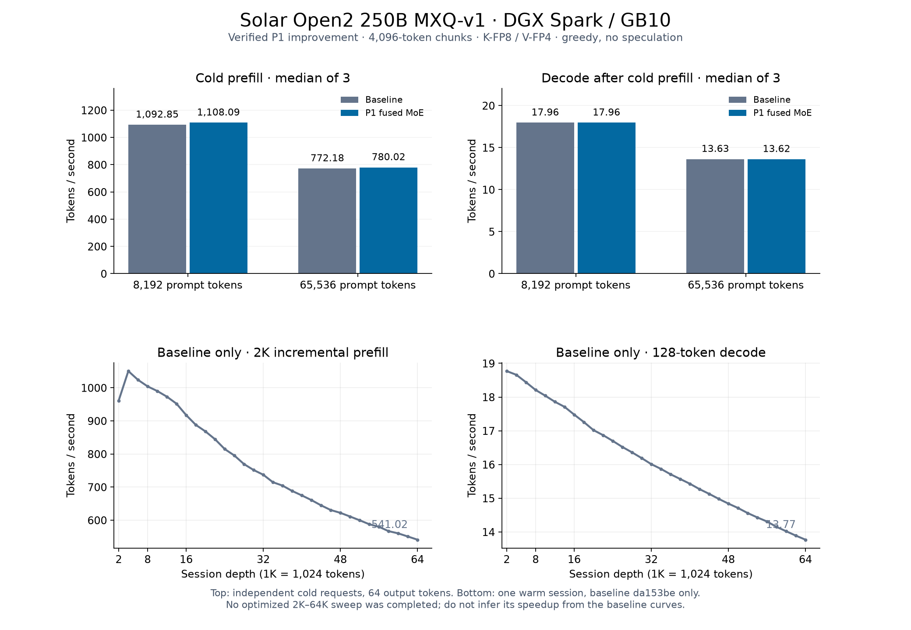

# Solar Open2 prefill and decode, 2026-09-07

Planned scope: two prefill rounds and two decode rounds on one DGX Spark.
The campaign was closed early at the user's request after repeated host
freezes and forced reboots during the second prefill round. Only the first
prefill improvement is retained; no decode improvement is claimed.
The starting runtime is
`da153beffbd936c75400e58c70c85fa19ebc1249`; the model weights are unchanged.

## Fixed workload

- Solar Open2 250B `MXQ-v1`: all 11 shards, 95,533,532,160 bytes,
  from [`Baekpica/Solar-Open2-250B-Mixed-Quant-GGUF`](https://huggingface.co/Baekpica/Solar-Open2-250B-Mixed-Quant-GGUF).
  Every shard matched `MXQ-v1-SHA256SUMS` before loading.
- NVIDIA GB10, CUDA 13.3, native `sm_121a` build; one resident VMM/base
  owner with 16 GiB reserve, 80 aligned IQ2 and 421 aligned Q8 artifacts.
- K-FP8/V-FP4 GQA KV, 4,096-token prefill chunks, greedy decoding without
  speculation. No simultaneous production model or build during timing.
- Corpus: `speed-bench/promessi_sposi.txt`, SHA256
  `f53e0d80cb2d4492d24ebd63c7000c397b16ae70f9bf09b3763e5d8323ec209f`.
- Cold single-shot `ds4-bench`: `--ctx-start N --ctx-max N
  --gen-tokens 64`, N = 8,192 and 65,536. Fresh process for each sample,
  interleaved off/on order A1 B1 B2 A2 A3 B3; median of three per variant.
- Every cold sample dumps all 196,608 frontier logits and all 64 greedy
  token IDs. Adoption requires byte equality to the previous accepted path.
- The graph's bottom row is the **baseline-only** incremental workload:
  2,048-token appends on one warm session from 2K through 64K, 128 greedy
  tokens at every frontier. Its prefill rate is not the throughput of a
  cold 64K request. An optimized sweep was not completed.

The older model-card HTTP measurements at 8,222 and 66,761 prompt tokens
used another runtime and request protocol. They are historical serving
evidence, not the baseline for the percentage gains in this campaign.

## Initial profile

Unprofiled opening observations were 1,101.10 / 777.38 tok/s cold prefill
at 8K / 64K, and 17.94 / 13.67 tok/s decode. Each round remeasures its own
baseline; the opening observations are not used as substitute A/B samples.

`nsys --trace=cuda,nvtx` separates the measured prefill from the two boot
warmup chunks and the 32-token decode window:

| GPU kernel group | 8K prefill time | 64K prefill time |
|---|---:|---:|
| Compressed GQA HMMA attention | 0.333 s | 28.696 s |
| Routed MMQ worklist | 1.220 s | 9.724 s |
| IQ2 gate/up pair | 1.105 s | 8.879 s |
| Dense Q8 D2R | 1.072 s | 8.624 s |
| KDA scan / factor / prep | 1.359 s | 10.823 s |
| Expert sum and all residual adds | 0.455 s | 3.659 s |

The 32-token decode profile attributes 1.023 s to aligned dense Q8,
0.534 s to grouped GQA split attention and 0.113 s to its combine pass at
64K. This makes long-context attention a separate target from dense weight
traffic and short-context recurrent-state work.

## Round record

### Prefill 1: finish the MoE block in one pass

Solar batch execution previously materialized the expert sum, added the
shared expert, then added that result to the residual. The new kernel
keeps the finite-value guard and ascending expert-slot accumulation, then
performs the same two separately rounded F32 additions. It removes two
full hidden-buffer passes. `DS4_SOLAR_MOE_RESIDUAL=0` restores the old path.
Decode and other model families retain their prior dispatch.

`tests/test_solar_gates` verifies byte equality against the three original
GPU operations at 1, 7, 257 and 4,096 rows, including an unaligned hidden
width, nonfinite routed values and cancellation. It also rejects null,
short and overlapping buffers before any write. Independent code review
found no blocking issue. All twelve full-model samples preserved every
frontier logit and generated token, including rebuilt-off versus the saved
baseline binary at both contexts.

| Cold prompt | Prefill before → after | Change | Decode before → after |
|---|---:|---:|---:|
| 8,192 tokens | 1,092.85 → 1,108.09 tok/s | +1.39% | 17.96 → 17.96 tok/s |
| 65,536 tokens | 772.18 → 780.02 tok/s | +1.02% | 13.63 → 13.62 tok/s |

In the 8K trace, the expert sum plus the two replaced additions took about
0.379 s; the fused pass takes 0.281 s across 96 layer executions. The
attention residual addition remains separate. The 0.01 tok/s decode
difference at 64K is below 0.1%; the decode execution path is unchanged.
Round 1 is adopted. Raw repetitions are in
[`solar-open2-2026-09-07-rounds.csv`](solar-open2-2026-09-07-rounds.csv).

## Published graph and data



The top row compares the twelve verified P1 cold samples. The bottom row
shows the completed baseline sweep at `da153be`, with 32 measured frontiers.
It contains no extrapolated optimized curve. Raw baseline values are in
[`solar-open2-2026-09-07-baseline-sweep.csv`](solar-open2-2026-09-07-baseline-sweep.csv).
Recreate the image with `python3 tools/plot_solar_open2_20260907.py`
(requires matplotlib; does not load a model).

P1 runtime commit: `c274f3cf81130dbbd83b9202fcbcf939f23e2124`.
Each fresh-process cold sample used this command with N = 8192 or 65536:

```sh
DS4_CUDA_WEIGHT_IPC_MANIFEST="$RUN/weights.manifest" \
DS4_CUDA_WEIGHT_IPC_SCOPE=base DS4_MEMGOV=observe \
DS4_CONT_PREFILL_CHUNK=4096 DS4_METAL_PREFILL_CHUNK=4096 \
DS4_SOLAR_KV_FORMAT=kfp8-vfp4 DS4_SOLAR_MOE_RESIDUAL=1 \
./ds4-bench --cuda -m "$MODEL" \
  --prompt-file speed-bench/promessi_sposi.txt \
  --ctx-start "$N" --ctx-max "$N" --step-incr 2048 --gen-tokens 64 \
  --csv "$RUN/sample.csv" --dump-frontier-logits-dir "$RUN/sample.d"
```

The rebuilt old path uses `DS4_SOLAR_MOE_RESIDUAL=0`; the control also
matched the saved baseline binary. The incremental sweep instead uses
`--ctx-start 2048 --ctx-max 65536 --step-incr 2048 --gen-tokens 128`.
These commands document the measured protocol, not authorization to resume
the stopped campaign.

## Campaign closure and limits

| Round | Final disposition |
|---|---|
| Prefill 1 | Adopted: fused MoE sum and residual additions; twelve exact full-model samples |
| Prefill 2 | Excluded: attention occupancy candidate passed component checks, but the 64K campaign was interrupted by host freezes |
| Decode 1 | Excluded: attention-combine draft, no completed model gate |
| Decode 2 | Not run |

The partial second-round measurements are excluded from the graph and all
published gains. The uncommitted attention candidates were archived locally
and removed from the submitted source. Remaining rounds were not replaced
with additional experiments.

The host froze again during guarded 64K testing and required a forced
reboot. The persisted kernel journal does not establish OOM or a CUDA Xid
as the cause. The cause remains unresolved; neither the attention candidate
nor memory pressure has been isolated as the culprit.

[`host-memory-guard.md`](host-memory-guard.md) describes the accompanying
optional process guard. Small-process tests cover cgroup limits, admission,
descendant cleanup and separate worker/owner trip floors. They are not a
proof against host lockups; the guard did not prevent this recurrence.

The campaign stopped before live HTTP, tool continuation, disk-KV reuse or
concurrent-agent gates. P1 changes the multi-token prefill MoE finish only;
the cold benchmark does not establish an agent latency or concurrency gain.
No further model was loaded and serving was not restarted after the final
reboot. Historical model-card serving evidence retains its original runtime
and request protocol.
